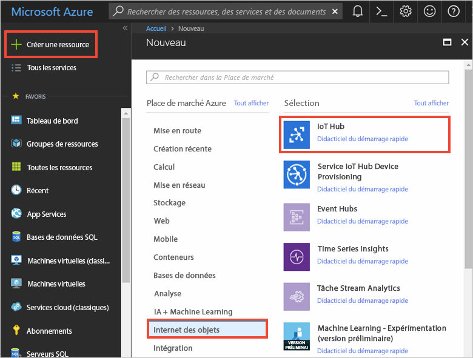
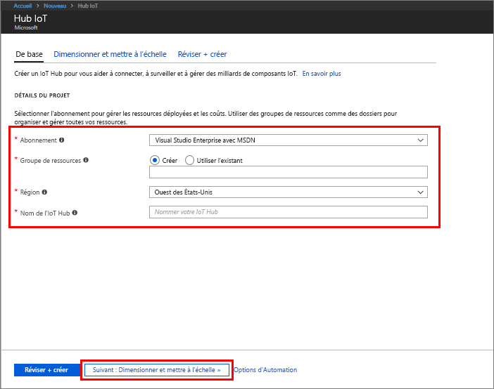
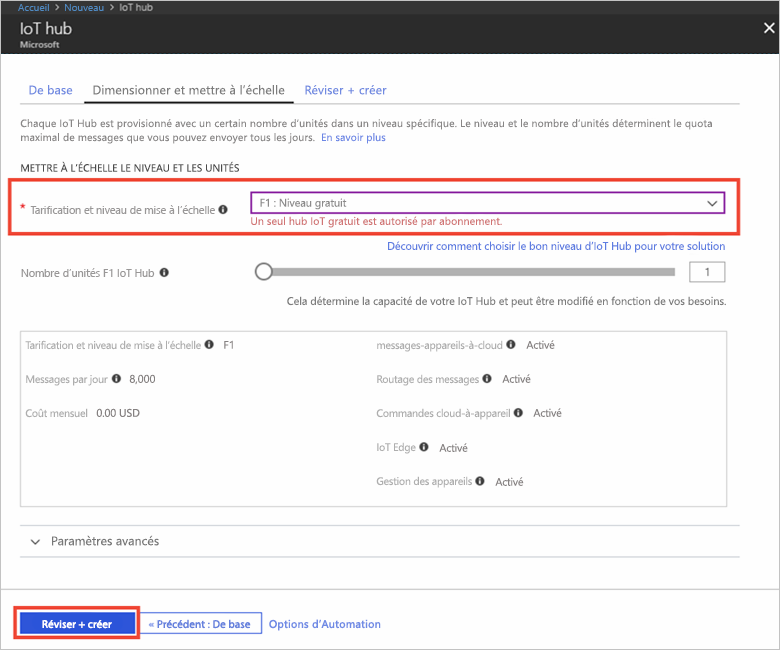

1. Connectez-vous au [Portail Azure](https://portal.azure.com/).

2. Sélectionnez **Créer une ressource** > **Internet des objets** > **IoT Hub**.
   
    

3. Dans le volet **IoT Hub**, entrez les informations suivantes pour votre IoT Hub :

   * **Abonnement** : choisissez l’abonnement que vous souhaitez utiliser pour créer cet IoT Hub.

   * **Groupe de ressources** : créez un groupe de ressources pour héberger l’IoT Hub ou utilisez-en un existant. Pour plus d’informations, consultez [Utilisation des groupes de ressources pour gérer vos ressources Azure](../articles/azure-resource-manager/resource-group-portal.md).

   * **Région** : sélectionnez la région correspondant à votre emplacement.

   * **Nom** : créer un nom de votre IoT Hub. Si le nom saisi est disponible, une coche verte s’affiche.

   [!INCLUDE [iot-hub-pii-note-naming-hub](iot-hub-pii-note-naming-hub.md)]

   

4. Sélectionnez **Suivant : taille et échelle** pour poursuivre la création de votre IoT Hub. 

5. Choisissez votre **niveau de tarification et de mise à l’échelle**. Pour cet article, sélectionnez le niveau **F1 - Gratuit** s’il est toujours disponible sur votre abonnement. Pour plus d’informations, consultez [Niveau de tarification et de mise à l’échelle](https://azure.microsoft.com/pricing/details/iot-hub/).

   

6. Sélectionnez **Revoir + créer**.

7. Passez en revue vos informations d’IoT Hub, puis cliquez sur **Créer**. La création de votre IoT Hub peut prendre plusieurs minutes. Vous pouvez suivre la progression dans le volet **Notifications**.