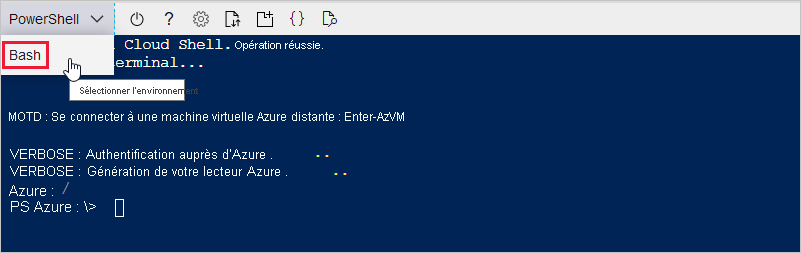

Dans les sections suivantes, vous allez configurer un terminal et utiliser Azure CLI pour créer un hub IoT. Pour configurer un terminal qui exécute des commandes Azure CLI, vous pouvez utiliser Azure Cloud Shell dans le navigateur ou utiliser un terminal local.
* Pour utiliser Cloud Shell, passez à la section suivante : [Lancer Cloud Shell](#launch-the-cloud-shell). 
* Pour utiliser un terminal local, ignorez la section suivante et accédez à [Ouvrir un terminal local](#open-a-local-terminal).

## <a name="launch-the-cloud-shell"></a>Lancer Cloud Shell
Dans cette section, vous créez une session Cloud Shell et vous configurez l’environnement de votre terminal.

Connectez-vous au portail Azure sur https://portal.azure.com.  

Pour lancer Cloud Shell :

1. Sélectionnez le bouton **Cloud Shell** dans la barre de menus en haut à droite du portail Azure. 

    

    > [!NOTE]
    > S’il s’agit de la première fois que vous utilisez Cloud Shell, vous êtes invité à créer un stockage, requis pour utiliser Cloud Shell.  Sélectionnez un abonnement pour créer un compte de stockage et un partage Microsoft Azure Files. 

2. Sélectionnez votre environnement CLI préféré dans la liste déroulante **Sélectionner l’environnement**. Ce démarrage rapide utilise l’environnement **Bash**. Toutes les commandes CLI suivantes fonctionnent également dans l’environnement PowerShell. 

    

3. Ignorez la section suivante et accédez à [Installer l’extension Azure IoT](#install-the-azure-iot-extension). 

## <a name="open-a-local-terminal"></a>Ouvrir un terminal local
Si vous avez choisi d’utiliser un terminal local plutôt que Cloud Shell, suivez cette section.  

1. Ouvrez un terminal local.
1. Exécutez la commande [az login](/cli/azure/reference-index#az_login) :

   ```azurecli
   az login
   ```

    Si l’interface CLI peut ouvrir votre navigateur par défaut, elle le fait et charge une page de connexion Azure par la même occasion.

    Sinon, ouvrez une page de navigateur à l’adresse https://aka.ms/devicelogin et entrez le code d’autorisation affiché dans votre terminal.

    Si aucun navigateur web n’est disponible ou si l’ouverture du navigateur web échoue, utilisez le flux de code de l’appareil avec `az login --use-device-code`.

1. Dans le navigateur, connectez-vous avec les informations d’identification de votre compte.

    Pour en savoir plus sur les différentes méthodes d’authentification, consultez [Se connecter avec Azure CLI]( /cli/azure/authenticate-azure-cli ).

1. Accédez à la section [Installer l’extension Azure IoT](#install-the-azure-iot-extension). 

## <a name="install-the-azure-iot-extension"></a>Installer l’extension Azure IoT
Dans cette section, vous installez l’extension Microsoft Azure IoT pour Azure CLI dans votre shell CLI. L’extension IoT ajoute des commandes IoT Hub, IoT Edge et IoT Device Provisioning Service (DPS) à Azure CLI.

> [!IMPORTANT]
> Les commandes du terminal dans le reste de ce guide de démarrage rapide fonctionnent de la même façon dans Cloud Shell et dans un terminal local. Pour exécuter une commande, sélectionnez **Copier** pour copier un bloc de code dans ce guide de démarrage rapide. Collez-le ensuite dans votre shell CLI et exécutez-le.

Exécutez la commande [az extension add](/cli/azure/extension#az_extension_add). 

   ```azurecli
   az extension add --name azure-iot
   ```
[!INCLUDE [iot-hub-cli-version-info](iot-hub-cli-version-info.md)]

## <a name="create-an-iot-hub"></a>Créer un hub IoT
Dans cette section, vous utilisez Azure CLI pour créer un hub IoT et un groupe de ressources.  Un groupe de ressources Azure est un conteneur logique dans lequel les ressources Azure sont déployées et gérées. Un hub IoT agit en tant que hub de messages central pour la communication bidirectionnelle entre votre application IoT et les appareils. 

Pour créer un hub IoT et un groupe de ressources :

1. Exécutez la commande [az group create](/cli/azure/group#az_group_create) pour créer un groupe de ressources. La commande suivante crée un groupe de ressources nommé *MyResourceGroup* à l’emplacement *eastus* : 
    >[!NOTE]
    > Vous pouvez éventuellement définir une autre région. Pour voir les régions disponibles, exécutez `az account list-locations`. Ce tutoriel utilise *eastus* comme indiqué dans l’exemple de commande. 

    ```azurecli
    az group create --name MyResourceGroup --location eastus
    ```

1. Exécutez la commande [az iot hub create](/cli/azure/iot/hub#az_iot_hub_create) pour créer un hub IoT. La création de votre hub IoT peut prendre plusieurs minutes. 

    *YourIotHubName*. Remplacez cet espace réservé et les accolades qui l’entourent dans la commande suivante, en utilisant le nom que vous avez choisi pour votre hub IoT. Le nom du hub IoT doit être globalement unique dans Azure. Utilisez le nom de votre hub IoT dans le reste de ce guide de démarrage rapide là où vous voyez l’espace réservé.

    ```azurecli
    az iot hub create --resource-group MyResourceGroup --name {YourIoTHubName}
    ```

## <a name="create-a-simulated-device"></a>Créez un appareil simulé.
Dans cette section, vous créez un appareil IoT simulé connecté à votre hub IoT. 

Pour créer un appareil simulé :
1. Exécutez la commande [az iot hub device-identity create](/cli/azure/iot/hub/device-identity#az_iot_hub_device_identity_create) dans votre shell CLI. Cela crée l’identité de l’appareil simulé. 

    *YourIotHubName*. Remplacez l’espace réservé ci-dessous par le nom que vous avez choisi pour votre hub IoT. 

    *myDevice*. Vous pouvez utiliser ce nom directement pour l’ID de l’appareil simulé dans le reste de cet article. Vous pouvez aussi utiliser un autre nom. 

    ```azurecli
    az iot hub device-identity create --device-id myDevice --hub-name {YourIoTHubName} 
    ```

1.  Exécutez la commande [az iot hub device-identity connection-string show](/cli/azure/iot/hub/device-identity/connection-string#az_iot_hub_device_identity_connection_string_show). 

    ```azurecli
    az iot hub device-identity connection-string show --device-id myDevice --hub-name {YourIoTHubName}
    ```

    La chaîne de connexion en sortie est au format suivant :

    ```Output
    HostName=<your IoT Hub name>.azure-devices.net;DeviceId=<your device id>;SharedAccessKey=<some value>
    ```

1. Enregistrez la chaîne de connexion en lieu sûr. 

> [!NOTE]
> Laissez le shell CLI ouvert. Vous l’utiliserez plus tard.