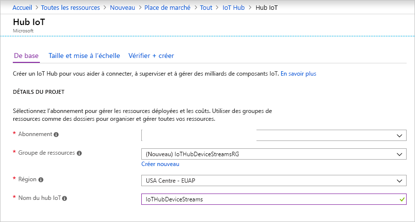

Cette section décrit comment créer un hub IoT à l’aide du [portail Azure](https://portal.azure.com).

1. Connectez-vous au [Portail Azure](https://portal.azure.com).

2. Choisissez +**Créer une ressource**, puis choisissez **Internet des objets**.

3. Cliquez sur **IoT Hub** dans la liste à droite. Vous voyez le premier écran de création d’un hub IoT.

   

   Renseignez les champs :

   **Abonnement**: Sélectionnez l’abonnement à utiliser pour votre hub IoT.

   **Groupe de ressources** : Vous pouvez créer un groupe de ressources ou utiliser un groupe existant. Pour créer un nouveau groupe, cliquez sur **Créer** et indiquez le nom que vous voulez utiliser. Pour utiliser un groupe de ressources existant, cliquez sur **Utiliser existant** et sélectionnez le groupe de ressources dans la liste déroulante. Pour plus d’informations, consultez [Gérer des groupes de ressources Azure Resource Manager](../articles/azure-resource-manager/manage-resource-groups-portal.md).

   **Région** : Il s’agit de la région dans laquelle vous voulez placer votre hub. Sélectionnez une région qui prend en charge la préversion des flux d’appareil IoT Hub : USA Centre ou EUAP USA Centre.

   **Nom du hub IoT** : Indiquez le nom de votre hub IoT. Ce nom doit être globalement unique. Si le nom saisi est disponible, une coche verte s’affiche.

   [!INCLUDE [iot-hub-pii-note-naming-hub](iot-hub-pii-note-naming-hub.md)]

4. Cliquez sur **Suivant : taille et échelle** pour poursuivre la création de votre hub IoT.

   

   Dans cet écran, vous pouvez conserver les valeurs par défaut et cliquer simplement en bas sur **Vérifier + créer**.

   **Tarification et niveau de mise à l’échelle** : Veillez à sélectionner le niveau Standard (S1, S2, S3) ou le niveau Gratuit (F1). Ce choix peut également être guidé par la taille de votre parc et les charges de travail hors flux que vous prévoyez dans votre hub (par exemple les messages de télémétrie). Par exemple, le niveau Gratuit est destiné aux tests et à l’évaluation. Il permet la connexion de 500 appareils à IoT Hub, avec jusqu’à 8 000 messages par jour. Chaque abonnement Azure peut créer un IoT Hub dans le niveau gratuit. 

   **Unités IoT Hub** : Ce choix dépend de la charge de la charge de travail hors flux que vous prévoyez dans votre hub : vous pouvez sélectionner 1 pour l’instant.

   Pour plus d’informations sur les autres options de niveau, consultez [Choix du bon niveau IoT Hub](../articles/iot-hub/iot-hub-scaling.md).

5. Cliquez sur **Vérifier + créer** pour passer en revue vos choix. Vous voyez quelque chose de similaire à cet écran.

   

6. Cliquez sur **Créer** pour créer votre hub IoT. La création du hub prend quelques minutes.
