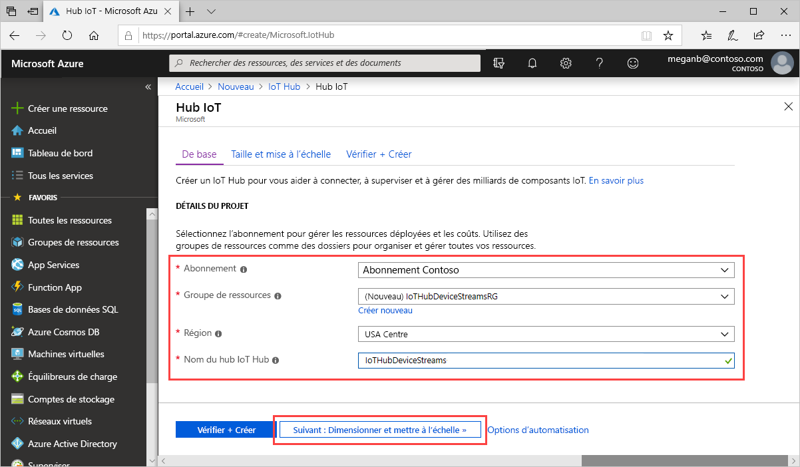
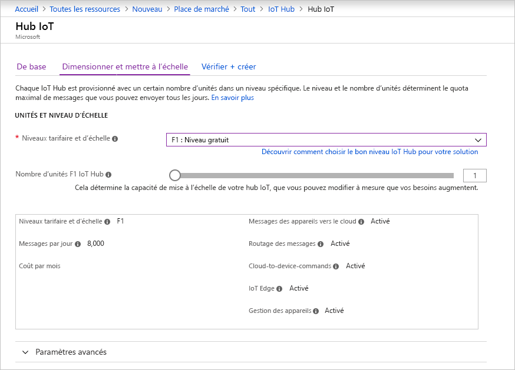

Cette section décrit comment créer un hub IoT à l’aide du [portail Azure](https://portal.azure.com).

1. Connectez-vous au [portail Azure](https://portal.azure.com).

1. Choisissez **Créer une ressource**, puis entrez *IoT Hub* dans le champ **Rechercher dans le marketplace**.

1. Sélectionnez **IoT Hub** dans les résultats de la recherche, puis **Créer**.

1. Dans l'onglet **De base**, renseignez les champs comme suit :

   - **Abonnement**: Sélectionnez l’abonnement à utiliser pour votre hub.

   - **Groupe de ressources** : Sélectionnez un groupe de ressources ou créez-en un. Pour créer un nouveau groupe, sélectionnez **Créer** et indiquez le nom que vous voulez utiliser. Pour utiliser un groupe de ressources existant, sélectionnez-le. Pour plus d’informations, consultez [Gérer des groupes de ressources Azure Resource Manager](../articles/azure-resource-manager/management/manage-resource-groups-portal.md).

   - **Région** : Choisissez la région dans laquelle vous voulez placer votre hub. Sélectionnez une région qui prend en charge la préversion des flux d’appareil IoT Hub : **USA Centre** ou **EUAP USA Centre**.

   - **Nom du hub IoT** : Entrez un nom pour votre hub. Ce nom doit être globalement unique. Si le nom saisi est disponible, une coche verte s’affiche.

   

   [!INCLUDE [iot-hub-pii-note-naming-hub](iot-hub-pii-note-naming-hub.md)]

1. Sélectionnez **Suivant : taille et échelle** pour poursuivre la création de votre hub.

   

   Dans **Taille et échelle**, vous pouvez accepter les paramètres par défaut et sélectionner **Vérifier + créer** en bas. Considérez les options suivantes :

   - **Tarification et niveau de mise à l’échelle** : Le niveau sélectionné. Sélectionnez l’un des niveaux standard (**S1**, **S2** ou **S3**) ou **F1 : Niveau Gratuit**. Ce choix peut également être guidé par la taille de votre parc et les charges de travail hors flux que vous prévoyez dans votre hub, par exemple, les messages de télémétrie. Par exemple, le niveau Gratuit est destiné aux tests et à l’évaluation. Il permet la connexion de 500 appareils à IoT Hub, avec jusqu’à 8 000 messages par jour. Chaque abonnement Azure peut créer un hub IoT dans le niveau gratuit. 

   - **Nombre d’unités IoT Hub** : Le nombre de messages autorisés par unité par jour dépend du niveau de tarification de votre concentrateur. Ce choix dépend de la charge de travail hors flux que vous prévoyez dans votre hub. Vous pouvez sélectionner 1 pour l’instant.

   - **Paramètres avancés** > **Partitions appareil-à-cloud** : cette propriété associe les messages appareil-à-cloud au nombre de lecteurs simultanés des messages. La plupart des hubs ont besoin de seulement 4 partitions.

   Pour plus d’informations sur les options de niveau, consultez [Choisir le bon niveau de hub IoT](../articles/iot-hub/iot-hub-scaling.md).

1. Pour passer en revue vos choix, choisissez **Vérifier + créer**. Vous devez obtenir des résultats semblables à ce qui suit :

   

1. Pour créer votre hub IoT, sélectionnez **Créer**. Ce processus prend quelques minutes.
