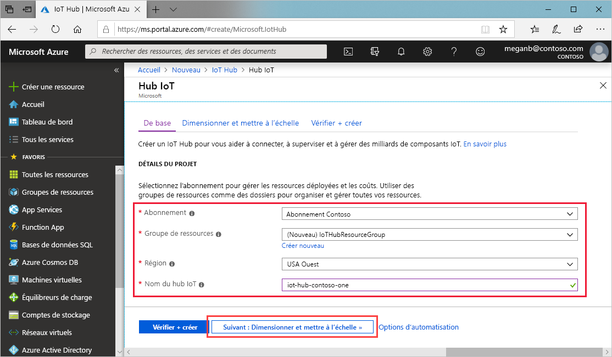
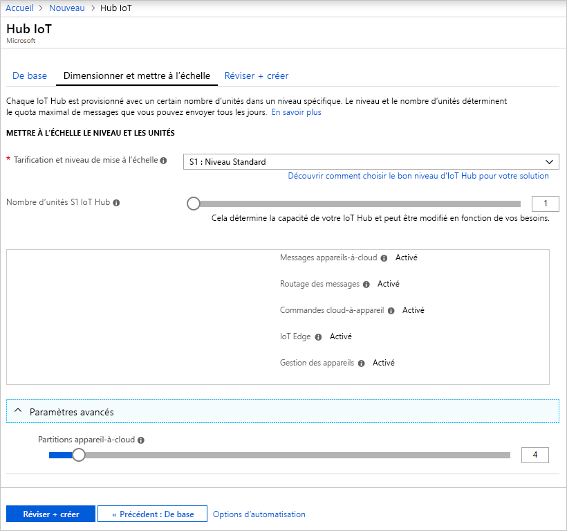
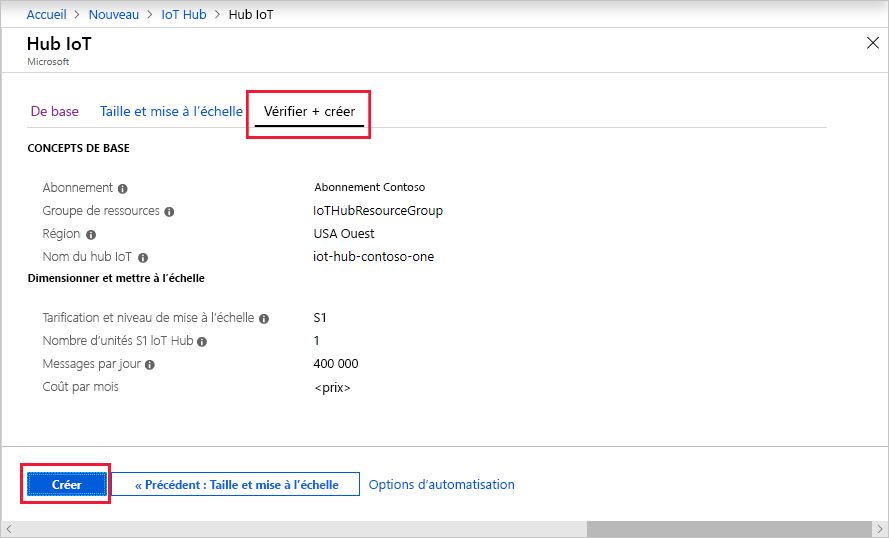

Cette section décrit comment créer un hub IoT à l’aide du [portail Azure](https://portal.azure.com).

1. Connectez-vous au [portail Azure](https://portal.azure.com).

1. Dans la page d’accueil Azure, sélectionnez le bouton **+ Créer une ressource**, puis entrez *IoT Hub* dans le champ **Rechercher dans la Place de marché**.

1. Sélectionnez **IoT Hub** dans les résultats de la recherche, puis **Créer**.

1. Dans l'onglet **De base**, renseignez les champs comme suit :

   - **Abonnement**: Sélectionnez l’abonnement à utiliser pour votre hub.

   - **Groupe de ressources** : Sélectionnez un groupe de ressources ou créez-en un. Pour créer un nouveau groupe, sélectionnez **Créer** et indiquez le nom que vous voulez utiliser. Pour utiliser un groupe de ressources existant, sélectionnez-le. Pour plus d’informations, consultez [Gérer des groupes de ressources Azure Resource Manager](../articles/azure-resource-manager/management/manage-resource-groups-portal.md).

   - **Région** : Sélectionnez la région dans laquelle vous voulez placer votre hub. Sélectionnez l’emplacement le plus proche de vous.

   - **Nom du hub IoT** : Entrez un nom pour votre hub. Ce nom doit être globalement unique. Si le nom saisi est disponible, une coche verte s’affiche.

   [!INCLUDE [iot-hub-pii-note-naming-hub](iot-hub-pii-note-naming-hub.md)]

   

1. Sélectionnez **Suivant : taille et échelle** pour poursuivre la création de votre hub.

   

    Cet écran vous permet de définir les valeurs suivantes :

    - **Tarification et niveau de mise à l’échelle** : Le niveau sélectionné. Vous pouvez choisir parmi plusieurs niveaux, selon le nombre de fonctionnalités souhaité et le nombre de messages envoyés par jour par l’intermédiaire de votre solution. Le niveau gratuit est destiné aux tests et à l’évaluation. Il permet la connexion de 500 appareils au hub, avec jusqu’à 8 000 messages par jour. Chaque abonnement Azure peut créer un hub IoT dans le niveau gratuit.

    - **Unités IoT Hub** : Le nombre de messages autorisés par unité par jour dépend du niveau de tarification de votre concentrateur. Par exemple, si vous souhaitez que le hub prenne en charge l’arrivée de 700 000 messages, vous choisissez deux unités de niveau S1.
    Pour plus d’informations sur les autres options de niveau, consultez [Choix du bon niveau IoT Hub](../articles/iot-hub/iot-hub-scaling.md).

    - **Paramètres avancés** > **Partitions appareil-à-cloud** : cette propriété associe les messages appareil-à-cloud au nombre de lecteurs simultanés des messages. La plupart des hubs n’ont besoin que de 4 partitions.

1. Pour cet article, acceptez les options par défaut, puis sélectionnez **Vérifier + créer** pour passer en revue vos choix. Vous voyez quelque chose de similaire à cet écran.

   

1. Sélectionnez **Créer** pour créer votre hub. La création du hub prend quelques minutes.
