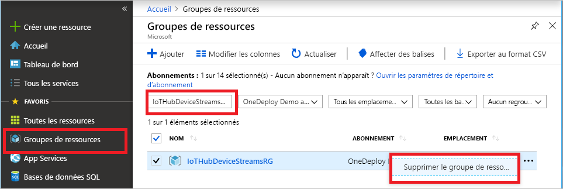

Si vous envisagez de passer à l’article recommandé suivant, vous pouvez conserver et réutiliser les ressources déjà créées.

Sinon, vous pouvez supprimer les ressources Azure créées dans cet article pour éviter des frais.

> [!IMPORTANT]
> La suppression d’un groupe de ressources est irréversible. Le groupe de ressources et toutes les ressources qu’il contient sont supprimés définitivement. Veillez à ne pas supprimer accidentellement les mauvaises ressources ou le mauvais groupe de ressources. Si vous avez créé le hub IoT à l’intérieur d’un groupe de ressources existant qui contient des ressources que vous souhaitez conserver, supprimez uniquement la ressource du hub IoT, plutôt que le groupe de ressources.
>

Pour supprimer un groupe de ressources par nom :

1. Connectez-vous au [Portail Azure](https://portal.azure.com), puis sélectionnez **Groupes de ressources**.

1. Dans la zone **Filtrer par nom**, entrez le nom du groupe de ressources contenant votre hub IoT.

1. Dans la liste des résultats, à droite de votre groupe de ressources, sélectionnez les points de suspension (**...**), puis **Supprimer le groupe de ressources**.

    

1. Pour confirmer la suppression du groupe de ressources, entrez une nouvelle fois le nom du groupe de ressources, puis sélectionnez **Supprimer**. Après quelques instants, le groupe de ressources et toutes les ressources qu’il contient sont supprimés.
