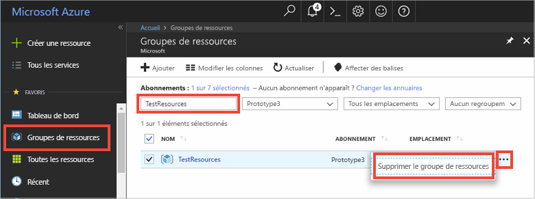

Si vous envisagez de passer à l’article recommandé suivant, vous pouvez conserver les ressources déjà créées afin de les réutiliser.

Sinon, vous pouvez supprimer les ressources Azure créées dans cet article pour éviter des frais. 

> [!IMPORTANT]
> La suppression d’un groupe de ressources est irréversible. Le groupe de ressources et toutes les ressources qu’il contient sont supprimés définitivement. Veillez à ne pas supprimer accidentellement des ressources ou un groupe de ressources incorrects. Si vous avez créé l’IoT Hub à l’intérieur d’un groupe de ressources existant qui concerne des ressources que vous souhaitez conserver, supprimer uniquement la ressource de l’ IoT Hub au lieu de supprimer le groupe de ressources.
>

Pour supprimer un groupe de ressources par nom :

1. Connectez-vous au [portail Azure](https://portal.azure.com), puis sélectionnez **Groupes de ressources**.

2. Dans la zone de texte **Filtrer par nom**, saisissez le nom du groupe de ressources contenant votre IoT Hub. 

3. À droite de votre groupe de ressources dans la liste des résultats, sélectionnez **...** , puis **Supprimer le groupe de ressources**.

    

4. Il vous sera demandé de confirmer la suppression du groupe de ressources. Saisissez à nouveau le nom de votre groupe de ressources pour confirmer, puis sélectionnez **Supprimer**. Après quelques instants, le groupe de ressources et toutes les ressources qu’il contient sont supprimés.