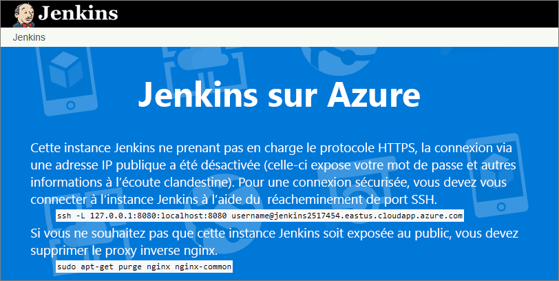
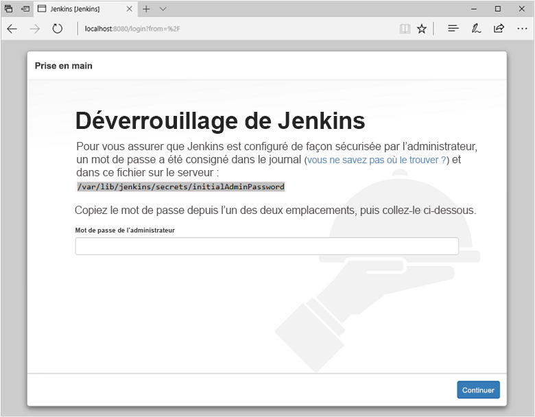
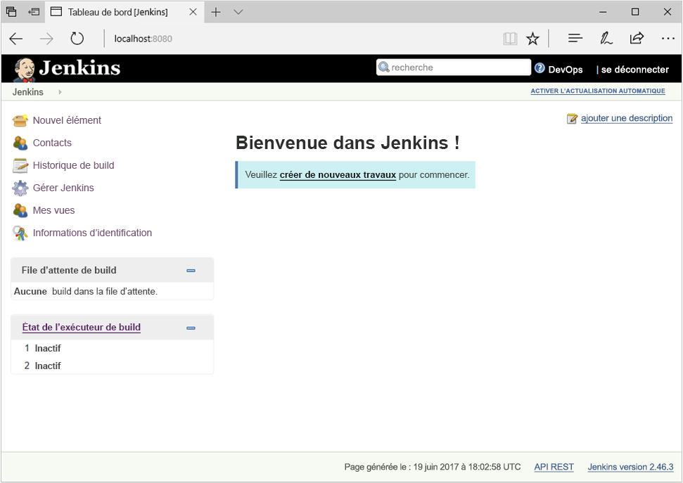
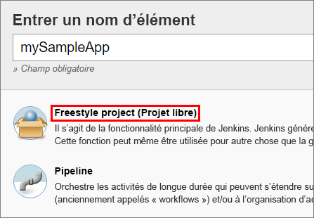
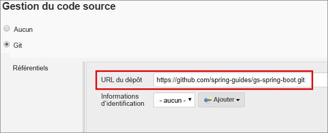
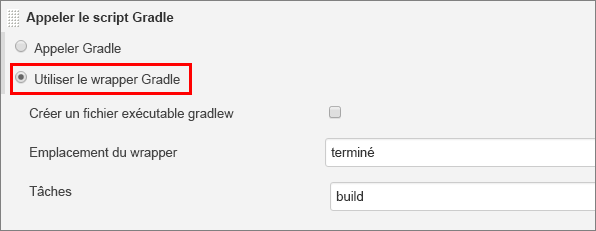
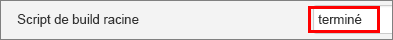
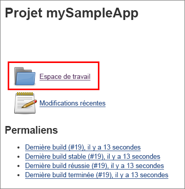

## <a name="prerequisites"></a>Prérequis

* Abonnement Azure
* Accéder à SSH sur la ligne de commande de votre ordinateur (par exemple l’interpréteur de commandes Bash ou [PuTTY](https://www.putty.org/))

[!INCLUDE [quickstarts-free-trial-note](quickstarts-free-trial-note.md)]

## <a name="create-the-jenkins-vm-from-the-solution-template"></a>Créer la machine virtuelle Jenkins à partir du modèle de solution
Jenkins prend en charge un modèle où le serveur Jenkins délègue le travail à un ou plusieurs agents pour permettre une seule installation Jenkins visant à héberger un grand nombre de projets ou de fournir des différents environnements nécessaires pour les builds ou des tests. Les étapes décrites dans cette section vous guident dans l’installation et la configuration d’un serveur Jenkins sur Azure.

[!INCLUDE [jenkins-install-from-azure-marketplace-image](jenkins-install-from-azure-marketplace-image.md)]

## <a name="connect-to-jenkins"></a>Se connecter à Jenkins

Accédez à votre machine virtuelle (par exemple, `http://jenkins2517454.eastus.cloudapp.azure.com/`) dans votre navigateur web. La console Jenkins n’est pas accessible via un protocole HTTP non sécurisé. Vous trouverez sur la page des informations pour accéder à la console Jenkins en toute sécurité à partir de votre ordinateur à l’aide d’un tunnel SSH.



Configurez le tunnel à l’aide de la commande `ssh` sur la page à partir de la ligne de commande. Remplacez `username` par le nom d’utilisateur administrateur de la machine virtuelle choisi précédemment lors de la configuration de la machine virtuelle à partir du modèle de solution.

```bash
ssh -L 127.0.0.1:8080:localhost:8080 jenkinsadmin@jenkins2517454.eastus.cloudapp.azure.com
```

Une fois que vous avez démarré le tunnel, accédez à `http://localhost:8080/` sur votre ordinateur local. 

Obtenez le mot de passe initial en exécutant la commande suivante dans la ligne de commande tout en étant connecté à la machine virtuelle Jenkins via SSH.

```bash
sudo cat /var/lib/jenkins/secrets/initialAdminPassword
```

Déverrouillez le tableau de bord Jenkins pour la première fois avec le mot de passe initial.



Sélectionnez **Installer les plug-ins suggérés** sur l’autre page, puis créez un utilisateur administrateur Jenkins permettant d’accéder au tableau de bord Jenkins.



Le serveur Jenkins est maintenant prêt à générer des codes.

## <a name="create-your-first-job"></a>Créer votre premier travail

Sélectionnez **Créer de nouveaux travaux** à partir de la console Jenkins, puis entrez le nom **mySampleApp**. Sélectionnez **Projet Freestyle**, puis sélectionnez **OK**.

 

Sélectionnez l’onglet **Gestion du code source**, activez **Git**, puis entrez l’URL suivante dans le champ**URL du référentiel** : `https://github.com/spring-guides/gs-spring-boot.git`

 

Sélectionnez l’onglet **Générer**, puis sélectionnez **Ajouter une étape de génération**, **Appel du script Gradle**. Sélectionnez **Utiliser Gradle Wrapper**, puis entrez `complete` dans l’**emplacement de Wrapper** et `build` pour **Tâches**.

 

Sélectionnez **Avancé** puis entrez `complete` dans le champ **Script build racine**. Sélectionnez **Enregistrer**.

 

## <a name="build-the-code"></a>Générer le code

Sélectionnez **Générer maintenant** pour compiler le code et combiner l’exemple d’application. Lorsque le build est terminé, sélectionnez le lien**Espace de travail** pour le projet.

 

Accédez à `complete/build/libs` et assurez-vous que le `gs-spring-boot-0.1.0.jar` peut vérifier que votre build a été généré avec succès. Votre serveur Jenkins est maintenant prêt à générer vos propres projets dans Azure.

## <a name="troubleshooting-the-jenkins-solution-template"></a>Dépannage du modèle de solution Jenkins

Si vous constatez des bogues dans le modèle de solution Jenkins, enregistrez un problème dans le [référentiel GitHub Jenkins](https://github.com/azure/jenkins/issues).

## <a name="next-steps"></a>Étapes suivantes

> [!div class="nextstepaction"]
> [Ajouter des machines virtuelles Azure en tant qu’agents Jenkins](/azure/jenkins-azure-vm-agents)