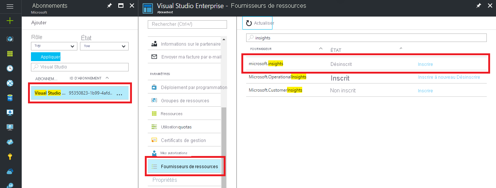

### Résoudre les problèmes de Diagnostics Azure

Si vous recevez le message d’erreur suivant, le fournisseur de ressources Microsoft.insights n’est pas enregistré :

`Failed to update diagnostics for 'resource'. {"code":"Forbidden","message":"Please register the subscription 'subscription id' with Microsoft.Insights."}`

Pour enregistrer le fournisseur de ressources, effectuez les opérations suivantes dans le portail Azure :

1.  Dans le volet de navigation à gauche, cliquez sur *Abonnements*
2.  Sélectionnez l’abonnement identifié dans le message d’erreur
3.  Cliquez sur *Fournisseurs de ressources*
4.  Recherchez le fournisseur *Microsoft.insights*
5.  Cliquez sur le lien *Enregistrer*

Une fois le fournisseur de ressources *Microsoft.insights* enregistré, tentez à nouveau de configurer les diagnostics.

Dans PowerShell, si vous recevez le message d’erreur suivant, vous devez mettre à jour votre version de PowerShell :

`Set-AzDiagnosticSetting : A parameter cannot be found that matches parameter name 'WorkspaceId'.`

Mettez à jour votre version d’Azure PowerShell et suivez les instructions de l’article [Installer Azure PowerShell](/powershell/azure/install-az-ps).
