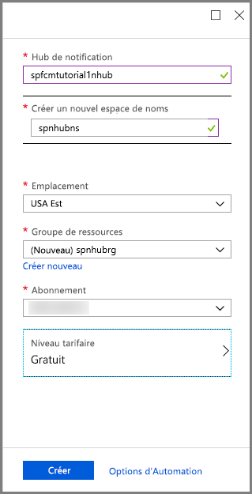
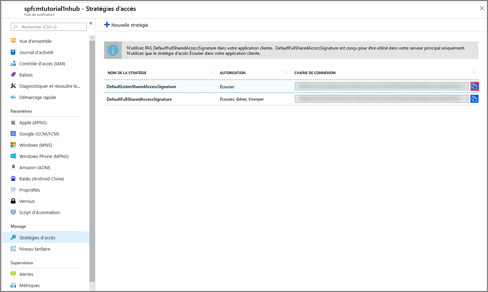

1. Connectez-vous au [Portail Azure](https://portal.azure.com).

2. Sélectionnez **Créer une ressource** > **Mobile** > **Hub de notification**.
   
      
      
3. Dans la zone **Hub de notification**, saisissez un nom unique. Sélectionnez votre **Région**, **Abonnement** et **Groupe de ressources** (si vous en avez déjà un). 
   
      Si vous ne disposez pas d’un espace de noms Service Bus, vous pouvez utiliser le nom par défaut, qui est créé à partir du nom du hub (si l’espace de noms est disponible).
    
      Si vous disposez déjà d’un espace de noms Service Bus dans lequel vous voulez créer le hub, suivez les étapes suivantes

    a. Dans la zone **Espace de noms**, sélectionnez le lien **Sélectionner un existant**. 
   
    b. Sélectionnez **Créer**.
   
      

4. Sélectionnez **Notifications** (icône de cloche) puis **Accéder à la ressource**. 

          
5. Sélectionnez **Stratégies d’accès** dans la liste. Notez les deux chaînes de connexion sont disponibles pour vous. Vous en avez besoin pour gérer les notifications Push plus tard.

      >[!IMPORTANT]
      >N’utilisez **PAS** le DefaultFullSharedAccessSignature dans votre application. Il est prévu pour être utilisé uniquement dans votre serveur principal.
      >
   
      

