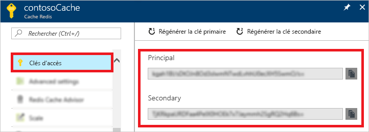
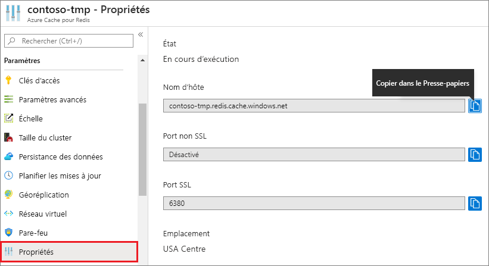

### Récupération du nom d’hôte, des ports et des clés d’accès à partir du portail Azure

Pour vous connecter à une instance Azure Cache pour Redis, les clients de cache ont besoin du nom d’hôte, des ports et d’une clé pour le cache. Certains clients peuvent référencer ces éléments par des noms légèrement différents. Vous pouvez récupérer le nom d’hôte, les ports et les clés d’accès à partir du [portail Azure](https://portal.azure.com).

- Pour récupérer les clés d’accès, sélectionnez **Clés d’accès** dans la barre de navigation de gauche du cache. 
  
  

- Pour récupérer le nom d’hôte et les ports, sélectionnez **Propriétés** dans la barre de navigation de gauche du cache. Le nom d'hôte prend la forme *\<Nom DNS>.redis.cache.windows.net*.

  

