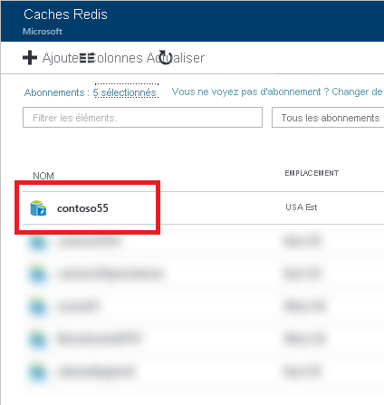

Si vous n’avez pas épinglé votre cache au tableau de bord, recherchez-le dans le [Portail Azure](https://portal.azure.com) en utilisant l’option **Tous les services**.

Pour afficher vos caches, cliquez sur **Tous les services**, puis recherchez **Cache Azure pour Redis**. 

Sélectionnez le cache souhaité pour afficher et configurer les paramètres de ce cache.

Vous pouvez afficher et configurer votre cache à partir du panneau **Cache Azure pour Redis**.

