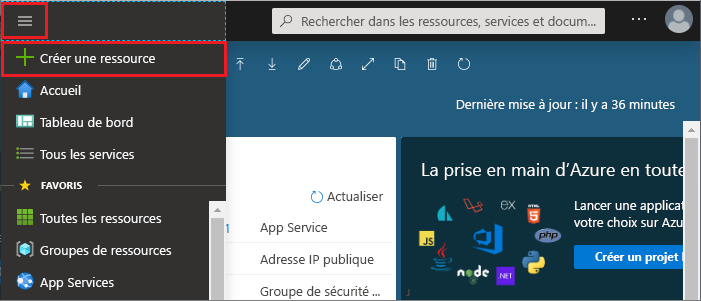
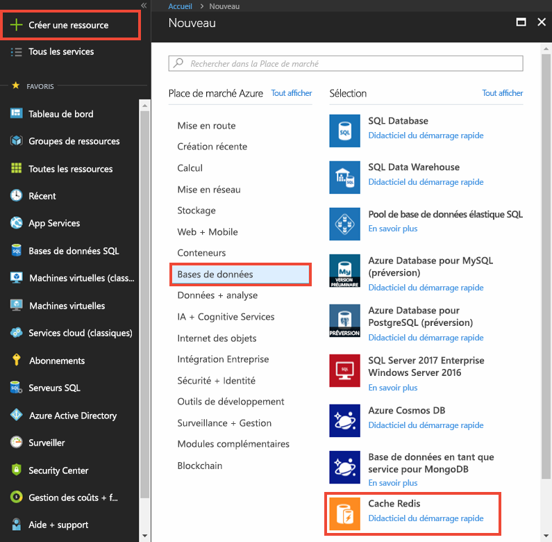
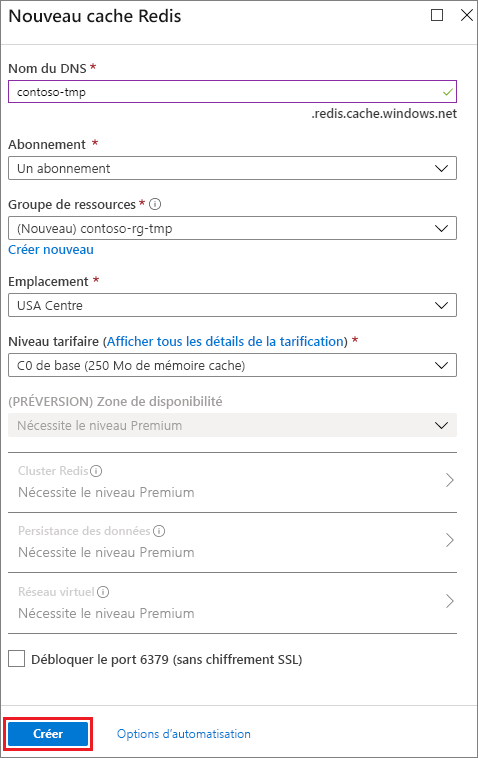
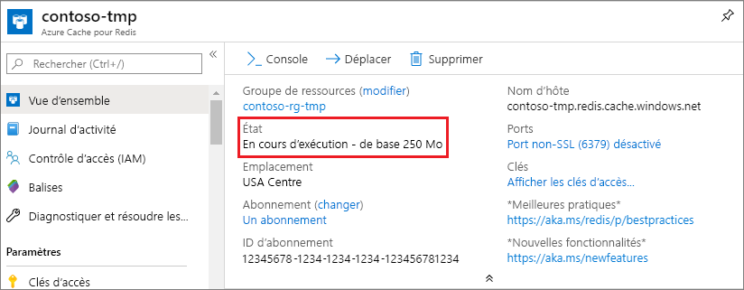

1. Pour créer un cache, connectez-vous au [portail Azure](https://portal.azure.com), puis sélectionnez **Créer une ressource**. 
   
   
   
1. Dans la page **Nouvelle**, sélectionnez **Bases de données**, puis **Azure Cache pour Redis**.
   
   
   
1. Dans la page **Nouveau cache Redis**, configurez les paramètres du nouveau cache.
   
   | Paramètre      | Valeur suggérée  | Description |
   | ------------ |  ------- | -------------------------------------------------- |
   | **Nom DNS** | Entrez un nom globalement unique. | Le nom du cache doit être une chaîne de 1 à 63 caractères ne contenant que des chiffres, des lettres et des traits d’union. Le nom doit commencer et se terminer par un chiffre ou une lettre, et ne peut pas contenir de traits d’union consécutifs. Le *nom d’hôte* de votre instance de cache sera *\<DNS name>.redis.cache.windows.net*. | 
   | **Abonnement** | Dans la liste déroulante, sélectionnez votre abonnement. | Abonnement sous lequel créer cette nouvelle instance d’Azure Cache pour Redis. | 
   | **Groupe de ressources** | Dans la liste déroulante, sélectionnez un groupe de ressources ou choisissez **Créer nouveau**, puis entrez un nouveau nom de groupe de ressources. | Nom du groupe de ressources dans lequel créer votre cache et d’autres ressources. En plaçant toutes les ressources de votre application dans un seul groupe de ressources, vous pouvez facilement les gérer ou les supprimer ensemble. | 
   | **Lieu** | Dans la liste déroulante, sélectionnez un emplacement. | Choisissez une [Région](https://azure.microsoft.com/regions/) proche d’autres services qui utiliseront votre cache. |
   | **Niveau tarifaire** | Sélectionnez un [Niveau tarifaire](https://azure.microsoft.com/pricing/details/cache/). |  Le niveau tarifaire détermine la taille, les performances et les fonctionnalités disponibles pour le cache. Pour plus d’informations, consultez [Présentation du cache Azure pour Redis](../articles/azure-cache-for-redis/cache-overview.md). |
   
1. Sélectionnez **Create** (Créer). 
   
    
   
   > [!NOTE]
   > Normalement, le provisionnement du cache prend 15 à 20 minutes environ.   
   
   Vous pouvez surveiller la progression dans la page **Vue d’ensemble** du Azure Cache pour Redis. Lorsque **État** indique **En cours d’exécution**, le cache est prêt pour utilisation.
   
   

