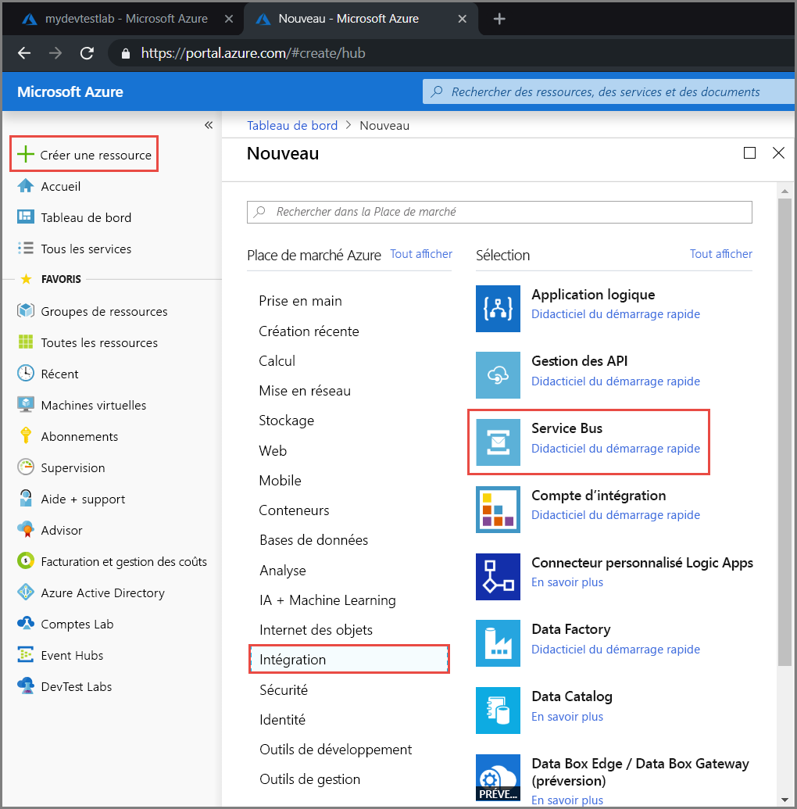
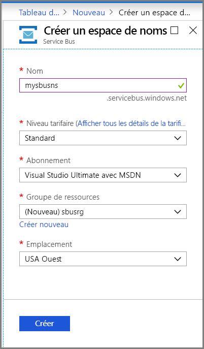
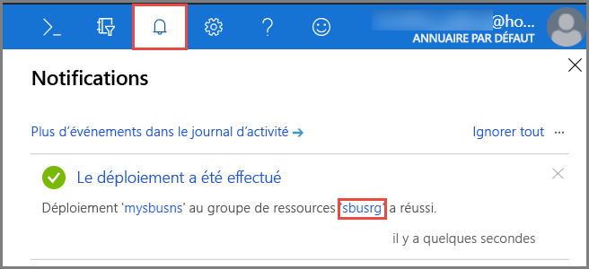
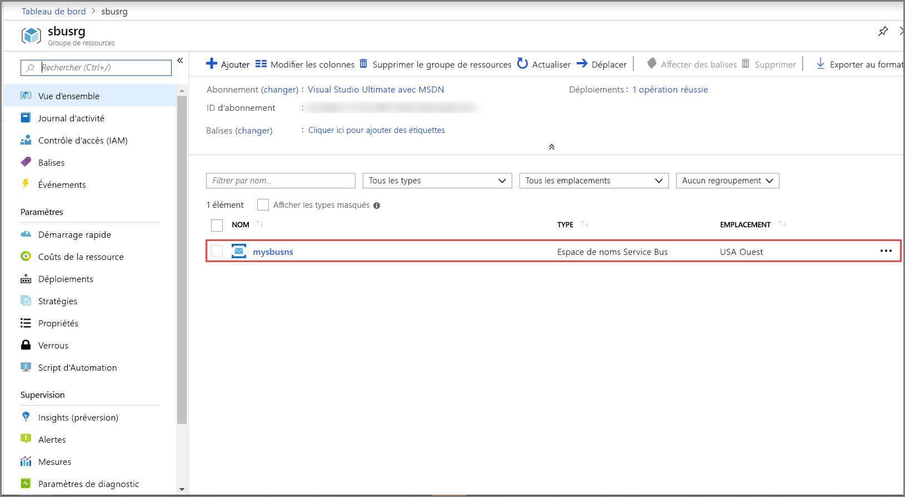
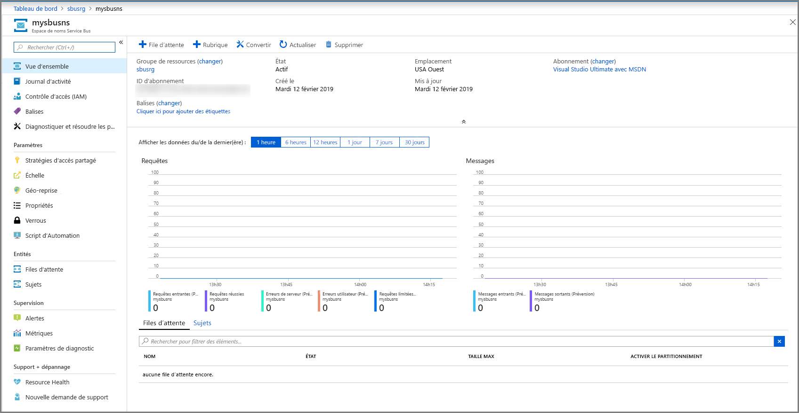
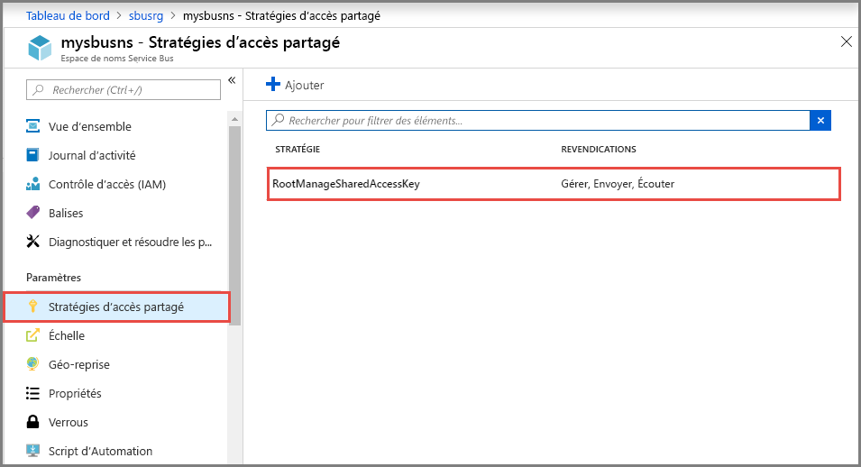
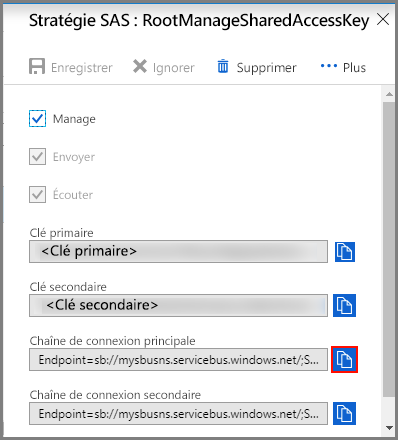

## Créer un espace de noms dans le Portail Azure
Pour commencer à utiliser des entités de messagerie Service Bus dans Azure, vous devez d’abord créer un espace de noms avec un nom unique dans Azure. Ce dernier fournit un conteneur d’étendue pour l’adressage des ressources Service Bus au sein de votre application.

Pour créer un espace de noms :

1. Connectez-vous au [portail Azure](https://portal.azure.com)
2. Dans le volet de navigation de gauche du portail, sélectionnez **+ Créer une ressource**, **Intégration**, puis **Service Bus**.

    
3. Dans la boîte de dialogue **Créer un espace de noms**, effectuez les étapes suivantes : 
    1. Entrez un **nom pour l’espace de noms**. Le système vérifie immédiatement si le nom est disponible. Pour obtenir la liste des règles de nommage des espaces de noms, consultez [API REST de création des espaces de noms](/rest/api/servicebus/create-namespace).
    2. Sélectionnez le niveau tarifaire (De base, Standard ou Premium) pour l’espace de noms. Si vous voulez utiliser des [rubriques et des abonnements](../articles/service-bus-messaging/service-bus-queues-topics-subscriptions.md#topics-and-subscriptions), choisissez Standard ou Premium. Les rubriques/abonnements ne sont pas pris en charge dans le niveau tarifaire De base.
    3. Si vous avez sélectionné le niveau tarifaire **Premium**, suivez ces étapes : 
        1. Spécifiez le nombre d’**unités de messagerie**. Le niveau Premium isole les ressources au niveau du processeur et de la mémoire, ce qui permet d’exécuter chaque charge de travail de manière isolée. Ce conteneur de ressources est appelé unité de messagerie. Un espace de noms Premium a au moins une unité de messagerie. Vous pouvez sélectionner une, deux ou quatre unités de messagerie pour chaque espace de noms Service Bus Premium. Pour plus d’informations, consultez [Messagerie Service Bus Premium](../articles/service-bus-messaging/service-bus-premium-messaging.md).
        2. Spécifiez si vous voulez rendre l’espace de noms **redondant interzone**. La redondance interzone offre une disponibilité améliorée en distribuant les réplicas dans toutes les zones de disponibilité au sein d’une même région sans coûts supplémentaires. Pour plus d’informations, consultez [Zones de disponibilité dans Azure](../articles/availability-zones/az-overview.md).
    4. Pour l’option **Abonnement**, choisissez un abonnement Azure dans lequel créer l’espace de noms.
    5. Pour l’option **Groupe de ressources**, choisissez un groupe de ressources existant dans lequel l’espace de noms sera utilisé, ou créez-en un nouveau.      
    6. Pour l’option **Emplacement**, choisissez la région dans laquelle héberger votre espace de noms.
    7. Sélectionnez **Create** (Créer). Le système crée l’espace de noms de service et l’active. Vous devrez peut-être attendre plusieurs minutes afin que le système approvisionne des ressources pour votre compte.
   
        
4. Vérifiez que l’espace de noms Service Bus est correctement déployé. Pour voir les notifications, sélectionnez l’**icône représentant une cloche (Alertes)** dans la barre d’outils. Sélectionnez le **nom du groupe de ressources** dans la notification, comme illustré dans l’image. Vous voyez le groupe de ressources qui contient l’espace de noms Service Bus.

    
5. Dans la page **Groupe de ressources** de votre groupe de ressources, sélectionnez votre **espace de noms Service Bus**. 

    
6. Vous voyez la page d’accueil de votre espace de noms Service Bus. 

    

## Obtenir la chaîne de connexion 
Créer un espace de noms génère automatiquement une règle de signature d’accès partagé (SAS) initiale comprenant une paire de clés primaire et secondaire qui vous offre un contrôle complet sur tous les aspects de l’espace de noms. Consultez [Authentification et autorisation Service Bus](../articles/service-bus-messaging/service-bus-authentication-and-authorization.md) pour plus d’information sur la façon de créer des règles avec des droits plus restreints pour les expéditeurs et destinataires réguliers. Pour copier les clés primaires et secondaires de votre espace de noms, suivez ces étapes : 

1. Cliquez sur **Toutes les ressources**, puis sur le nom de l’espace de noms que vous venez de créer.
2. Dans la fenêtre Espace de noms, cliquez sur **Stratégies d’accès partagé**.
3. Dans l’écran **Stratégies d’accès partagé**, cliquez sur **RootManageSharedAccessKey**.
   
    
4. Dans la fenêtre **Stratégie : RootManageSharedAccessKey**, cliquez sur le bouton Copier situé en regard de **Chaîne de connexion primaire**, pour copier la chaîne de connexion dans le presse-papiers pour une utilisation ultérieure. Copiez cette valeur dans le Bloc-notes ou un autre emplacement temporaire.
   
    
5. Répétez l’étape précédente, en copiant et collant la valeur de **Clé primaire** dans un emplacement temporaire pour l’utiliser ultérieurement.

<!--Image references-->

