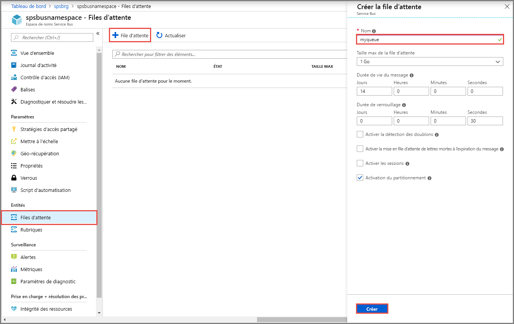

## Créer une file d’attente dans le portail Azure
4. Dans la page **Espace de noms Service Bus**, sélectionnez **Files d’attente** dans le menu de navigation de gauche.
5. Dans la page **Files d’attente**, sélectionnez **+ File d’attente** dans la barre d’outils.
5. Entrez un **nom** pour la file d’attente et laissez les valeurs par défaut des autres valeurs.
6. À présent, sélectionnez **Créer**.
 
    

