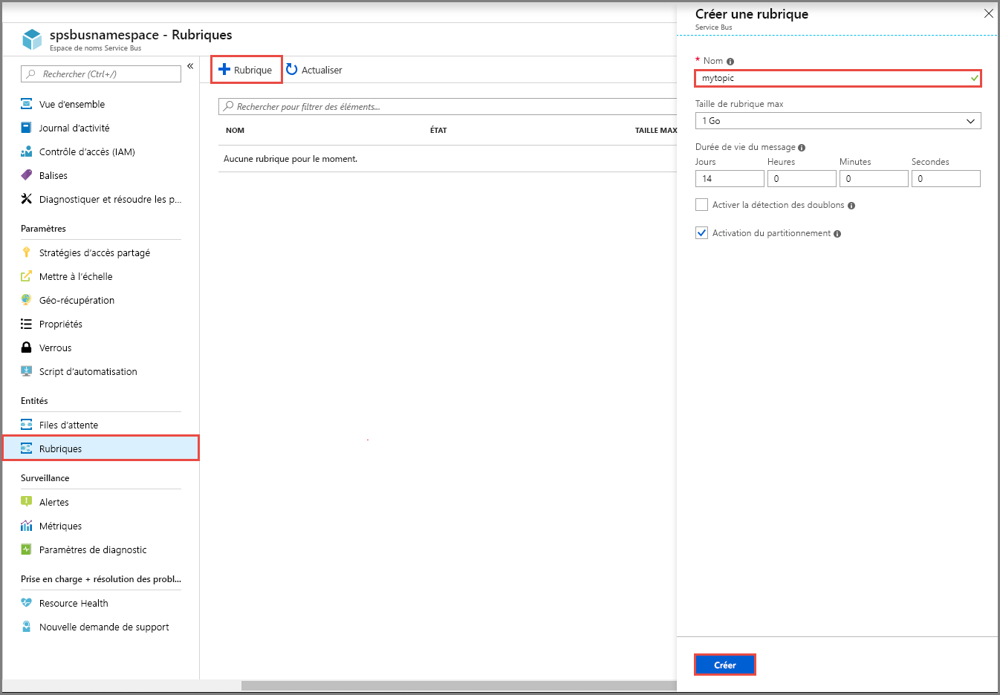
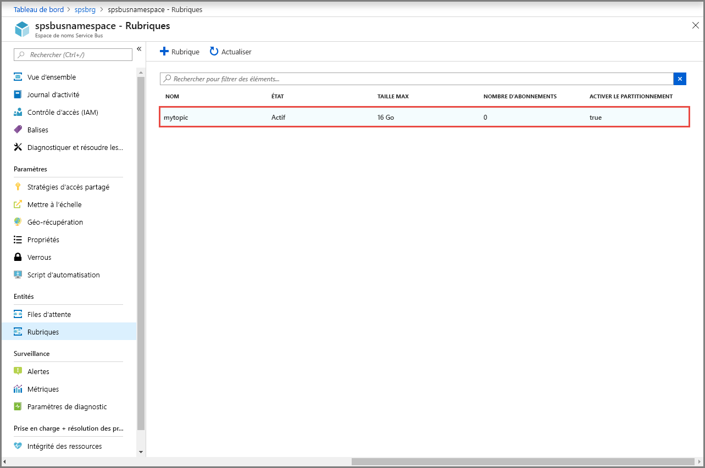
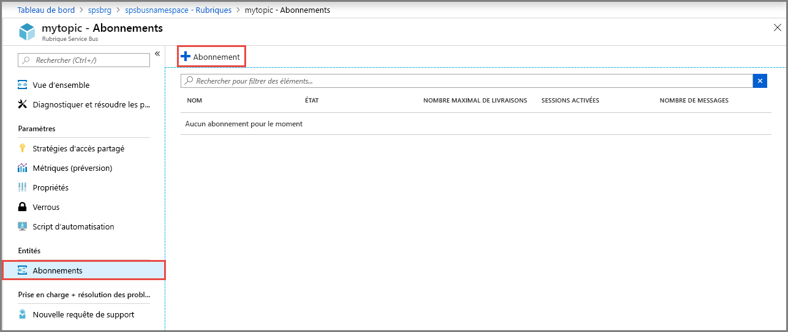

## Créer une rubrique à l’aide du Portail Azure
1. Dans la page **Espace de noms Service Bus**, sélectionnez **Rubriques** dans le menu de gauche.
2. Sélectionnez **+ Rubrique** dans la barre d’outils. 
4. Entrez un **nom** pour la rubrique. Conservez les valeurs par défaut des autres options.
5. Sélectionnez **Créer**.

    

## Créer un abonnement à la rubrique
1. Sélectionnez la **rubrique** que vous avez créée dans la section précédente. 
    
    
2. Dans la page **Rubrique Service Bus**, sélectionnez **Abonnements** dans le menu de gauche, puis **+ Abonnement** dans la barre d’outils. 
    
    
3. Dans la page **Créer un abonnement**, entrez un **nom** pour l’abonnement, puis sélectionnez **Créer**. 

    