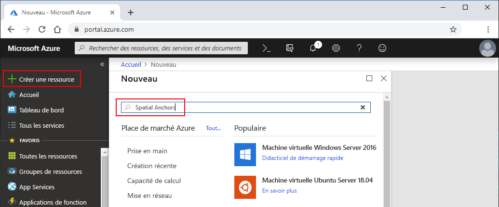
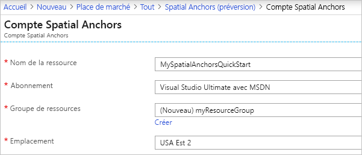
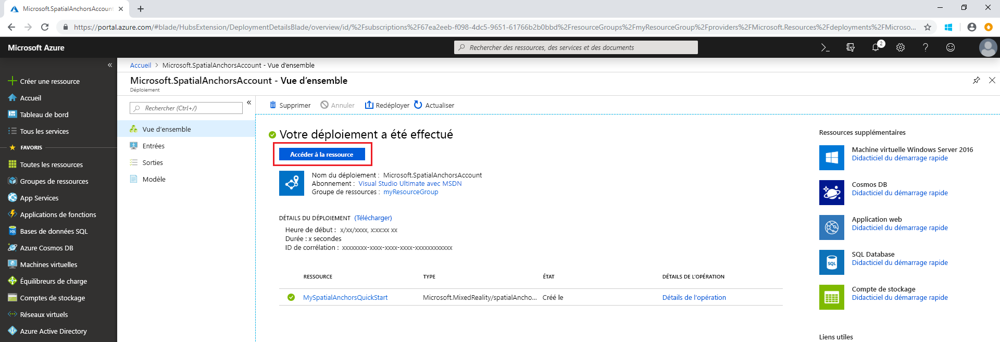
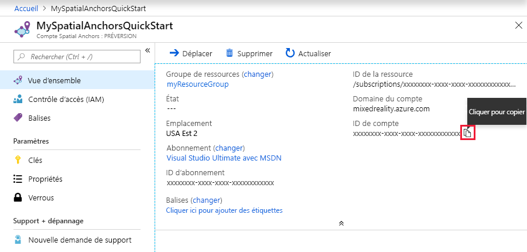
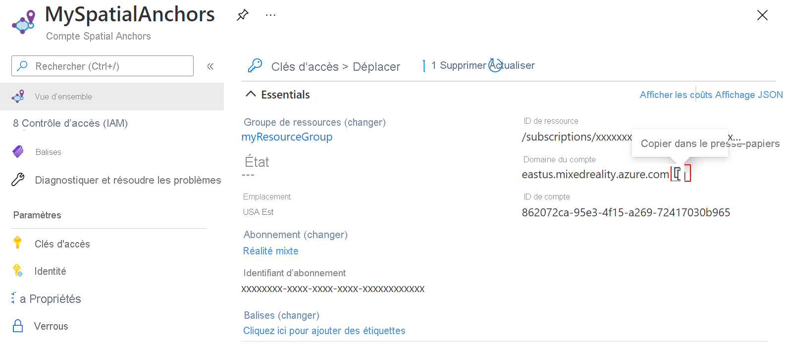
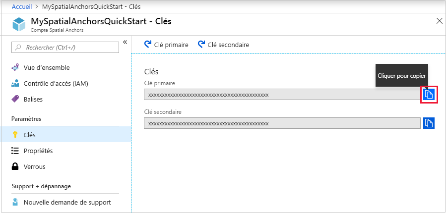

## <a name="create-a-spatial-anchors-resource"></a>Créer une ressource Spatial Anchors

### <a name="portal"></a>[Portail](#tab/azure-portal)

Accédez au <a href="https://portal.azure.com" target="_blank">portail Azure</a>.

Dans le volet de gauche, sélectionnez **Créer une ressource**.

Utilisez la zone de recherche pour rechercher **Spatial Anchors**.



Sélectionnez **Spatial Anchors**, puis **Créer**.

Dans le volet **Spatial Anchors Account** (compte Spatial Anchors), procédez comme suit :

* Entrez un nom de ressource unique, en utilisant des caractères alphanumériques normaux.
* Sélectionnez l’abonnement auquel attacher la ressource.
* Créer un groupe de ressources en sélectionnant **Créer**. Nommez-le **myResourceGroup**, puis sélectionnez **OK**.

  [!INCLUDE [resource group intro text](resource-group.md)]

* Sélectionnez un emplacement (région) où placer la ressource.
* Sélectionnez **Nouveau** pour commencer à créer la ressource.



Une fois la ressource créée, le portail Azure indique que votre déploiement est terminé.



Sélectionnez **Accéder à la ressource**. Vous pouvez à présent afficher les propriétés de la ressource.

Copiez la valeur **ID de compte** de la ressource dans un éditeur de texte en vue d’une utilisation ultérieure.



Copiez également le **Domaine du compte** de la ressource dans un éditeur de texte en vue d’une utilisation ultérieure.



Sous **Paramètres**, sélectionnez **Clé**. Copiez la valeur de **Clé primaire**, **Clé de compte**, dans un éditeur de texte en vue d’une utilisation ultérieure.



### <a name="azure-cli"></a>[Azure CLI](#tab/azure-cli)

Commencez par préparer votre environnement pour Azure CLI :

[!INCLUDE [azure-cli-prepare-your-environment-no-header.md](azure-cli-prepare-your-environment-no-header.md)]

1. Une fois que vous êtes connecté, utilisez la commande [az account set](/cli/azure/account#az_account_set) pour sélectionner l’abonnement dans lequel configurer le compte Spatial Anchors :

   ```azurecli
   az account set --subscription 00000000-0000-0000-0000-000000000000
   ```

1. Exécutez la commande [az group create](/cli/azure/group#az_group_create) pour créer un groupe de ressources ou utiliser un groupe de ressources existant :

   ```azurecli
   az group create --name myResourceGroup --location eastus2
   ```

   [!INCLUDE [resource group intro text](resource-group.md)]

   Vous pouvez voir vos comptes Spatial Anchors actuels pour un groupe de ressources à l’aide de la commande [az spatial-anchors-account list](/cli/azure/ext/mixed-reality/spatial-anchors-account#ext_mixed_reality_az_spatial_anchors_account_list) :

   ```azurecli
   az spatial-anchors-account list --resource-group myResourceGroup
   ```

   Vous pouvez également voir les comptes Spatial Anchors de votre abonnement :

   ```azurecli
   az spatial-anchors-account list
   ```

1. Exécutez la commande [az spatial-anchors-account create](/cli/azure/ext/mixed-reality/spatial-anchors-account#ext_mixed_reality_az_spatial_anchors_account_create) pour créer votre compte Spatial Anchors :

   ```azurecli
   az spatial-anchors-account create --resource-group myResourceGroup --name MySpatialAnchorsQuickStart --location eastus2
   ```

1. Affichez les propriétés de la ressource à l’aide de la commande [az spatial-anchors-account show](/cli/azure/ext/mixed-reality/spatial-anchors-account#ext_mixed_reality_az_spatial_anchors_account_show) :

   ```azurecli
   az spatial-anchors-account show --resource-group myResourceGroup --name MySpatialAnchorsQuickStart
   ```

   Copiez la valeur **ID de compte** de la ressource et la valeur **Domaine du compte** de la ressource dans un éditeur de texte à des fins d’utilisation ultérieure.

1. Exécutez la commande [az spatial-anchors-account key show](/cli/azure/ext/mixed-reality/spatial-anchors-account/key#ext_mixed_reality_az_spatial_anchors_account_key_show) pour obtenir vos clés primaires et secondaires :

   ```azurecli
   az spatial-anchors-account key show --resource-group myResourceGroup --name MySpatialAnchorsQuickStart
   ```

   Copiez les valeurs de clé dans un éditeur de texte à des fins d’utilisation ultérieure.

   Si vous avez besoin de regénérer des clés, utilisez la commande [az spatial-anchors-account key renew](/cli/azure/ext/mixed-reality/spatial-anchors-account/key#ext_mixed_reality_az_spatial_anchors_account_key_renew)  :

   ```azurecli
   az spatial-anchors-account key renew --resource-group myResourceGroup --name example --key primary
   az spatial-anchors-account key renew --resource-group myResourceGroup --name example --key secondary
   ```

Vous pouvez supprimer un compte à l’aide de la commande [az spatial-anchors-account delete](/cli/azure/ext/mixed-reality/spatial-anchors-account#ext_mixed_reality_az_spatial_anchors_account_delete) :

```azurecli
az spatial-anchors-account delete --resource-group myResourceGroup --name MySpatialAnchorsQuickStart
```

### <a name="azure-powershell"></a>[Azure PowerShell](#tab/azure-powershell)

Commencez par préparer votre environnement pour Azure PowerShell :

[!INCLUDE [azure-powershell-requirements-no-header.md](azure-powershell-requirements-no-header.md)]

> [!IMPORTANT]
> Tant que le module PowerShell **Az.MixedReality** est en préversion, vous devez l’installer séparément à l’aide de l’applet de commande `Install-Module`. Une fois que ce module PowerShell sera en disponibilité générale, il fera partie intégrante des versions futures du module PowerShell Az et sera disponible par défaut dans Azure Cloud Shell.

```azurepowershell-interactive
Install-Module -Name Az.MixedReality
```

1. Une fois que vous êtes connecté, utilisez la commande [Set-AzContext](/powershell/module/az.accounts/set-azcontext) pour sélectionner l’abonnement dans lequel configurer le compte Spatial Anchors :

   ```azurepowershell-interactive
   Set-AzContext -SubscriptionId 00000000-0000-0000-0000-000000000000
   ```

1. Exécutez l’applet de commande [New-AzResourceGroup](/powershell/module/az.resources/new-azresourcegroup) pour créer un groupe de ressources, ou utilisez un groupe de ressources existant :

   ```azurepowershell-interactive
   New-AzResourceGroup -Name myResourceGroup -Location eastus2
   ```

   [!INCLUDE [resource group intro text](resource-group.md)]

   Vous pouvez voir vos comptes Spatial Anchors actuels pour un groupe de ressources à l’aide de l’applet de commande [Get-AzSpatialAnchorsAccount](/powershell/module/az.mixedreality/get-azspatialanchorsaccount) :

   ```azurepowershell-interactive
   Get-AzSpatialAnchorsAccount -ResourceGroup myResourceGroup
   ```

   Vous pouvez également voir les comptes Spatial Anchors de votre abonnement :

   ```azurepowershell-interactive
   Get-AzSpatialAnchorsAccount
   ```

1. Exécutez l’applet de commande [New-AzSpatialAnchorsAccount](/powershell/module/az.mixedreality/new-azspatialanchorsaccount) pour créer votre compte Spatial Anchors :

   ```azurepowershell-interactive
   New-AzSpatialAnchorsAccount -ResourceGroup myResourceGroup -Name MySpatialAnchorsQuickStart -Location eastus2
   ```

1. Affichez les propriétés de ressources à l’aide de l’applet de commande [Get-AzSpatialAnchorsAccount](/powershell/module/az.mixedreality/get-azspatialanchorsaccount) :

   ```azurepowershell-interactive
   Get-AzSpatialAnchorsAccount -ResourceGroup myResourceGroup -Name MySpatialAnchorsQuickStart
   ```

   Copiez les valeurs **accountId** et **accountDomain** de la propriété dans un éditeur de texte pour une utilisation ultérieure.

1. Exécutez l’applet de commande [Get-AzSpatialAnchorsAccountKey](/powershell/module/az.mixedreality/get-azspatialanchorsaccountkey) pour récupérer vos clés primaires et secondaires :

   ```azurepowershell-interactive
   Get-AzSpatialAnchorsAccountKey -ResourceGroup myResourceGroup -Name MySpatialAnchorsQuickStart
   ```

   Copiez les valeurs de clé dans un éditeur de texte à des fins d’utilisation ultérieure.

   Si vous devez regénérer des clés, utilisez l’applet de commande [New-AzSpatialAnchorsAccountKey](/powershell/module/az.mixedreality/new-azspatialanchorsaccountkey) :

   ```azurepowershell-interactive
   New-AzSpatialAnchorsAccountKey -ResourceGroupName myResourceGroup -Name MySpatialAnchorsQuickStart -Primary
   New-AzSpatialAnchorsAccountKey -ResourceGroupName myResourceGroup -Name MySpatialAnchorsQuickStart -Secondary
   ```

Vous pouvez supprimer un compte à l’aide de l’applet de commande [Remove-AzSpatialAnchorsAccount](/powershell/module/az.mixedreality/remove-azspatialanchorsaccount) :

```azurepowershell-interactive
Remove-AzSpatialAnchorsAccount -ResourceGroup myResourceGroup -Name MySpatialAnchorsQuickStart
```

---
