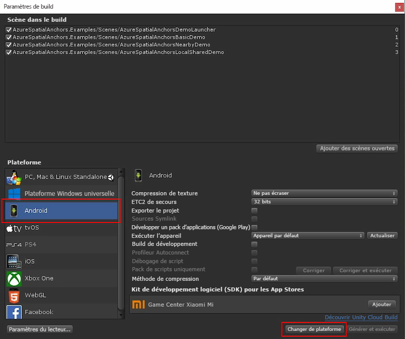

Ouvrez **Build Settings** (Paramètres de build) en sélectionnant **File** (Fichier) > **Build Settings** (Paramètres de build).

Dans la section **Plateforme** , sélectionnez **Android** , puis sélectionnez **Changer de plateforme** pour définir la plateforme **Android**. Unity peut vous demander d’installer des composants de prise en charge Android s’ils sont manquants.  

     

Fermez la fenêtre **Build Settings**.

