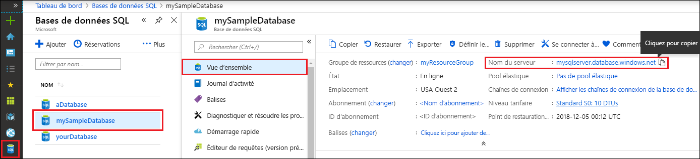

<!-- sql-database-connect-query-prerequisites-server-connection-info-includes.md 

## SQL server connection information
-->

Obtenez les informations de connexion requises pour la connexion à la base de données SQL Azure. Vous aurez besoin du nom du serveur complet, du nom de la base de données et des informations de connexion dans les procédures suivantes.

1. Connectez-vous au [Portail Azure](https://portal.azure.com/).

1. Sélectionnez **Bases de données SQL** dans le menu de gauche, puis cliquez sur votre base de données dans la page **Bases de données SQL**.

1. Sur la page **Vue d’ensemble** de votre base de données, vérifiez le nom complet du serveur, comme indiqué dans l’image suivante. Vous pouvez pointer sur le **nom du serveur** pour afficher l’option **Cliquer pour copier**.  

   

1. Si vous avez oublié vos informations de connexion au serveur, vous pouvez cliquer sur le **nom du serveur** pour accéder à la page du **serveur SQL** et afficher le nom de l’**administrateur du serveur**. Si nécessaire, sélectionnez **Réinitialiser le mot de passe**.
