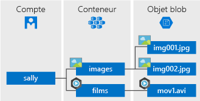

Le stockage Blob Azure est la solution de stockage d’objet de Microsoft pour le cloud. Le stockage Blob est optimisé pour stocker de grandes quantités de données non structurées, telles que des données texte ou binaires.

Stockage d’objets hautement évolutif pour les données non structurées

Le stockage Blob est idéal pour :

* Mise à disposition d’images ou de documents directement dans un navigateur.
* Stockage de fichiers pour un accès distribué.
* Diffusion en continu de vidéo et d’audio.
* Écriture dans les fichiers journaux.
* Stockage de données pour la sauvegarde et la restauration, la récupération d’urgence et l’archivage.
* Stockage des données pour l’analyse par un service local ou hébergé par Azure.

Les objets du stockage Blob sont accessibles n’importe où dans le monde via HTTP ou HTTPS. Les utilisateurs ou applications clientes peuvent accéder aux objets blob via des URL, l’[API REST Stockage Azure](https://docs.microsoft.com/rest/api/storageservices/blob-service-rest-api), [Azure PowerShell](https://docs.microsoft.com/powershell/module/azure.storage), [Azure CLI](https://docs.microsoft.com/cli/azure/storage) ou une bibliothèque de client Stockage Azure. Les bibliothèques de client de stockage sont disponibles dans plusieurs langages, tels que [.NET](https://docs.microsoft.com/dotnet/api/overview/azure/storage/client), [Java](https://docs.microsoft.com/java/api/overview/azure/storage/client), [Node.js](http://azure.github.io/azure-storage-node), [Python](https://docs.microsoft.com/python/azure/), [PHP](http://azure.github.io/azure-storage-php/) et [Ruby](http://azure.github.io/azure-storage-ruby).

## Concepts du service BLOB

Le stockage d’objets BLOB expose trois ressources : votre compte de stockage, les conteneurs du compte et les objets BLOB dans un conteneur. Le diagramme suivant montre la relation entre ces ressources.

### Compte de stockage

Tous les accès aux objets de données dans le stockage Azure se font via un compte de stockage. Pour plus d’informations, consultez [Vue d’ensemble des comptes de stockage Azure](../articles/storage/common/storage-account-overview.md?toc=%2fazure%2fstorage%2fblobs%2ftoc.json).

### Conteneur

Un conteneur regroupe un ensemble d’objets blob, à la manière d’un dossier dans un système de fichiers. Tous les objets blob se trouvent dans un conteneur. Un compte de stockage peut contenir un nombre illimité de conteneurs, et un conteneur peut stocker un nombre illimité d’objets blob. Notez que le nom du conteneur doit être en minuscules.

### Blob
 
Stockage Azure propose trois types d’objets blob : les objets blob de blocs, les objets blob d’ajout et les [objets blob de pages](../articles/storage/blobs/storage-blob-pageblob-overview.md) (utilisés pour les fichiers VHD).

* Les objets blob de blocs stockent du texte et des données binaires, jusqu’à environ 4,7 To. Ils sont composés de blocs de données qui peuvent être gérés individuellement.
* Les objets blob d’ajout se composent de blocs, comme les objets blob de blocs, mais sont optimisés pour les opérations d’ajout. Les objets blob d’ajout sont parfaits pour les scénarios tels que la consignation des données issues des machines virtuelles.
* Les objets blob de pages servent à stocker les fichiers à accès aléatoire d’une taille maximale de 8 To. Ils conservent les fichiers VHD qui soutiennent les machines virtuelles.

Tous les objets blob se trouvent dans un conteneur. Un conteneur est semblable à un dossier dans un système de fichiers. Vous pouvez organiser les objets blob dans des répertoires virtuels et les parcourir comme vous le feriez avec un système de fichiers. 

Pour les jeux de données très volumineux où les contraintes du réseau rendent irréaliste le téléchargement de données vers/depuis le stockage d’objets blob par le biais du réseau, vous pouvez expédier un ensemble de disques durs à Microsoft pour importer ou exporter les données directement à partir du centre de données. Pour plus d'informations, consultez [Utilisation du service Import/Export Microsoft Azure pour transférer des données vers le stockage d'objets blob](../articles/storage/common/storage-import-export-service.md).
  
Pour plus de détails sur l’affectation de noms aux conteneurs et objets blob, consultez [Affectation de noms et références aux conteneurs, objets blob et métadonnées](/rest/api/storageservices/Naming-and-Referencing-Containers--Blobs--and-Metadata).
