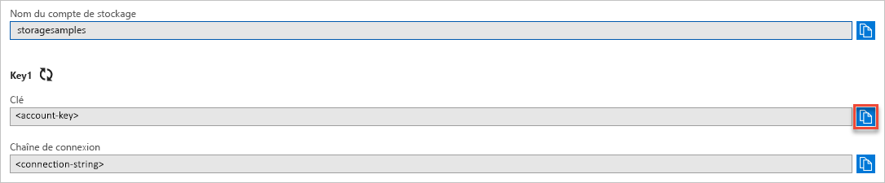

## Copier vos informations d’identification depuis le portail Azure

L’exemple d’application doit autoriser l’accès à votre compte de stockage. Fournissez les informations d’identification de votre compte de stockage à l’application sous la forme d’une chaîne de connexion. Pour afficher les informations d’identification de votre compte de stockage :

1. Dans le [portail Azure](https://portal.azure.com), accédez à votre compte de stockage.
1. Dans la section **Paramètres** de la vue d’ensemble du compte de stockage, sélectionnez **Clés d’accès** pour afficher les clés d’accès et la chaîne de connexion de votre compte.
1. Notez le nom de votre compte de stockage, vous en aurez besoin pour l’autorisation.   
1. Recherchez la valeur **Clé** sous **clé1**, puis sélectionnez **Copier** pour copier la clé de compte.

    
