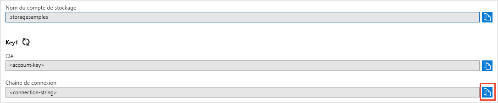

## Copier vos informations d’identification depuis le portail Azure

L’exemple d’application a besoin d’authentifier l’accès à votre compte de stockage. Pour l’authentification, ajoutez les informations d’identification de votre compte de stockage à l’application sous la forme d’une chaîne de connexion. Affichez les informations d'identification de votre compte de stockage en suivant ces étapes :

1. Connectez-vous au [portail Azure](https://portal.azure.com).
2. Recherchez votre compte de stockage.
3. Dans la section **Paramètres** de la présentation du compte de stockage, sélectionnez **Clés d’accès**. Vos clés d’accès au compte s’affichent, ainsi que la chaîne de connexion complète de chaque clé.
4. Recherchez la valeur de **Chaîne de connexion** sous **clé1**, puis sélectionnez le bouton **Copier** pour copier la chaîne de connexion. Vous allez ajouter la valeur de chaîne de connexion dans une variable d’environnement à l’étape suivante.

    
