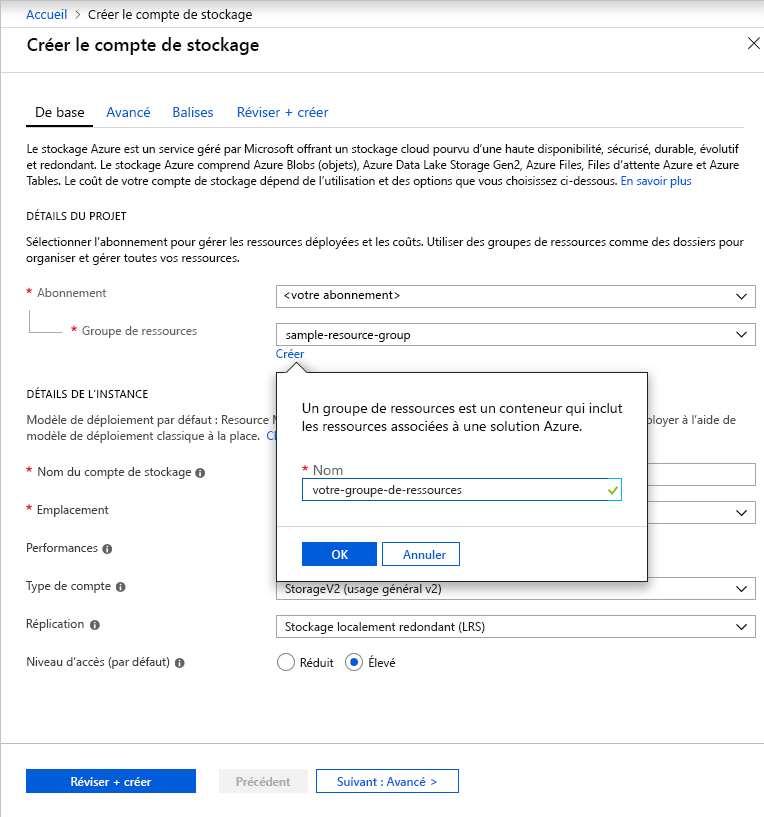

Pour créer un compte de stockage à usage général v2 dans le portail Azure, procédez comme suit :

1. Sur le portail Azure, développez le menu de gauche pour ouvrir le menu des services, et sélectionnez **Tous les services**. Faites défiler jusqu’à **Stockage**, puis sélectionnez **Comptes de stockage**. Sur la fenêtre **Comptes de stockage**, sélectionnez **Ajouter**.
1. Sélectionnez l’abonnement dans lequel créer le compte de stockage.
1. Sous le champ **Groupe de ressources**, cliquez sur **Créer un nouveau**. Entrez un nom pour votre nouveau groupe de ressources, comme indiqué dans l’image suivante.

    

1. Ensuite, entrez un nom pour votre compte de stockage. Le nom que vous choisissez doit être unique dans Azure, et contenir entre 3 et 24 caractères, uniquement des lettres minuscules et des chiffres.
1. Sélectionnez l’emplacement de votre compte de stockage ou utilisez l’emplacement par défaut.
1. Laissez ces champs définis sur leur valeur par défaut :
    - Le champ **Modèle de déploiement** est défini par défaut sur **Resource Manager**.
    - Le champ **Performances** est défini par défaut sur **Standard**.
    - Le champ **Type de compte** est défini par défaut sur **StorageV2 (v2 à usage général)**.
    - Le champ **Réplication** est défini par défaut sur **Stockage localement redondant (LRS)**.
    - Le champ **Niveau d’accès** est défini par défaut sur **Chaud**.

1. Cliquez sur **Vérifier + créer** pour passer en revue vos paramètres de compte de stockage et créer le compte.
1. Cliquez sur **Créer**.

Pour plus d’informations sur les types de comptes de stockage et d’autres paramètres de compte de stockage, consultez [Vue d’ensemble du compte de stockage Azure](https://docs.microsoft.com/azure/storage/common/storage-account-overview). Pour plus d’informations sur les groupes de ressources, consultez [Vue d’ensemble d’Azure Resource Manager](https://docs.microsoft.com/azure/azure-resource-manager/resource-group-overview). 
