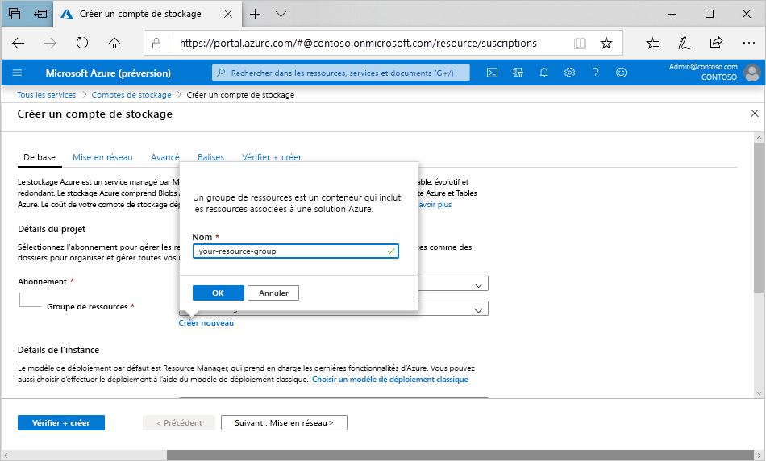

Pour créer un compte de stockage à usage général v2 dans le portail Azure, procédez comme suit :

1. Dans le menu du Portail Azure, sélectionnez **Tous les services**. Dans la liste des ressources, tapez **Comptes de stockage**. Au fur et à mesure de la saisie, la liste est filtrée. Sélectionnez **Comptes de stockage**.
1. Sur la fenêtre **Comptes de stockage**, sélectionnez **Ajouter**.
1. Sélectionnez l’abonnement dans lequel créer le compte de stockage.
1. Sous le champ **Groupe de ressources**, sélectionnez **Créer**. Entrez un nom pour votre nouveau groupe de ressources, comme indiqué dans l’image suivante.

    

1. Ensuite, entrez un nom pour votre compte de stockage. Le nom choisi doit être unique dans tout Azure. Le nom doit aussi contenir entre 3 et 24 caractères, et uniquement des lettres minuscules et des chiffres.
1. Sélectionnez l’emplacement de votre compte de stockage ou utilisez l’emplacement par défaut.
1. Laissez ces champs définis sur leur valeur par défaut :

   |Champ  |Valeur  |
   |---------|---------|
   |Modèle de déploiement     |Gestionnaire de ressources         |
   |Performances     |standard         |
   |Type de compte     |StorageV2 (usage général v2)         |
   |Réplication     |Stockage géo-redondant avec accès en lecture (RA-GRS)         |
   |Niveau d’accès     |À chaud         |

1. Cliquez sur **Vérifier + créer** pour passer en revue vos paramètres de compte de stockage et créer le compte.
1. Sélectionnez **Create** (Créer).

Pour plus d’informations sur les types de comptes de stockage et d’autres paramètres de compte de stockage, consultez [Vue d’ensemble du compte de stockage Azure](https://docs.microsoft.com/azure/storage/common/storage-account-overview). Pour plus d’informations sur les groupes de ressources, consultez [Vue d’ensemble d’Azure Resource Manager](https://docs.microsoft.com/azure/azure-resource-manager/resource-group-overview). 
