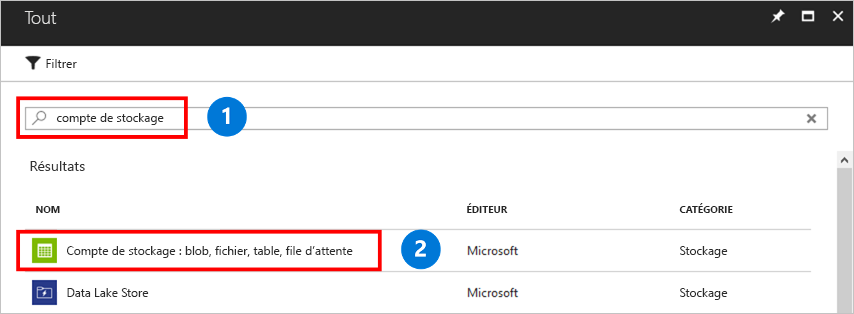

Un compte de stockage est un pool partagé de stockage dans lequel vous pouvez déployer un partage de fichiers Azure, ou d’autres ressources de stockage comme les objets blob ou les files d’attente. Un compte de stockage peut contenir un nombre illimité de partages. Un partage peut stocker un nombre illimité de fichiers, dans les limites de capacité du compte de stockage.

Pour créer un compte de stockage :

1. Dans le menu de gauche, sélectionnez **+** pour créer une ressource.
1. Dans la zone de recherche, tapez **Compte de stockage**, sélectionnez **Compte de stockage - blob, fichier, table, file d’attente**, puis sélectionnez **Créer**.
    

1. Dans **Nom**, tapez *mystorageacct* suivi de quelques nombres au hasard jusqu’à obtenir une marque verte, signe que le nom est unique. Le nom du compte de stockage doit être écrit entièrement en minuscules et être unique. Notez le nom de votre compte de stockage. Vous le réutiliserez ultérieurement. 
1. Dans **Modèle de déploiement**, laissez la valeur par défaut de **Resource Manager**. Pour en savoir plus sur les différences entre les modèles de déploiement Azure Resource Manager et classique, consultez [Comprendre les modèles de déploiement et l’état de vos ressources](../articles/azure-resource-manager/management/deployment-models.md).
1. Dans **Performances**, conservez la valeur par défaut (**Standard**).
    
    > [!NOTE]
    > Ce guide de démarrage rapide crée un partage de fichiers standard. Si vous souhaitez plutôt utiliser des partages de fichiers Premium, sélectionnez **Premium**.

1. Dans **Type de compte**, sélectionnez **StorageV2**. Pour en savoir sur les différents types de comptes de stockage, consultez [Comprendre les comptes de stockage Azure](../articles/storage/common/storage-account-options.md?toc=%2fazure%2fstorage%2ffiles%2ftoc.json).

    > [!NOTE]
    > Ce guide de démarrage rapide crée un compte v2 universel. Si vous avez choisi d’utiliser des partages de fichiers Premium, sélectionnez **FileStorage**.

1. Dans **Réplication**, sélectionnez **Stockage localement redondant (LRS)** . 
1. Dans **Transfert sécurisé requis**, nous vous recommandons de toujours sélectionner **Activé**. Pour en savoir plus sur cette option, consultez [Comprendre le chiffrement en transit](../articles/storage/common/storage-require-secure-transfer.md?toc=%2fazure%2fstorage%2ffiles%2ftoc.json).
1. Dans **Abonnement**, sélectionnez l’abonnement utilisé pour créer le compte de stockage. Si vous n’avez qu’un abonnement, il est proposé par défaut.
1. Dans **Groupe de ressources**, sélectionnez **Créer**. Entrez le nom *myResourceGroup*.
1. Dans **Emplacement**, sélectionnez **USA Est**.
1. Dans **Réseaux virtuels**, laissez l’option par défaut **Désactivé**. 
1. Sélectionnez **Épingler au tableau de bord** pour que le compte de stockage soit plus facile à trouver.
1. Lorsque vous avez terminé, sélectionnez **Créer** pour commencer le déploiement.