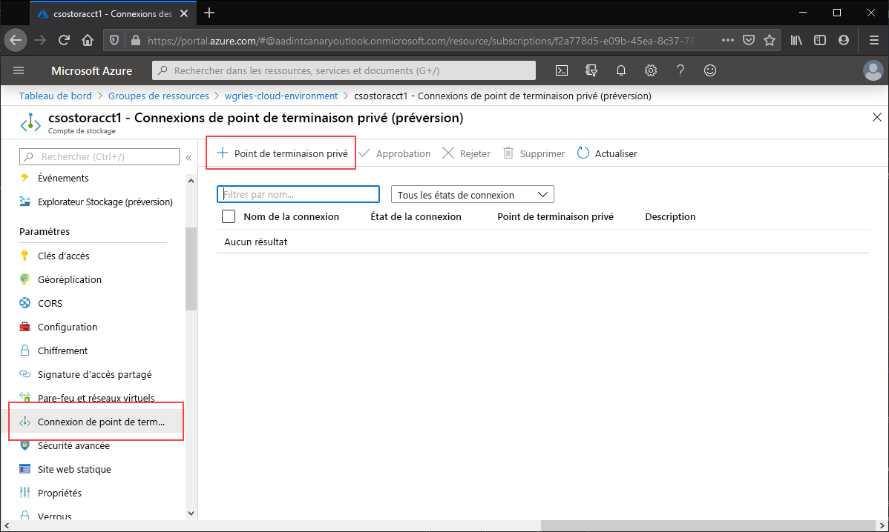
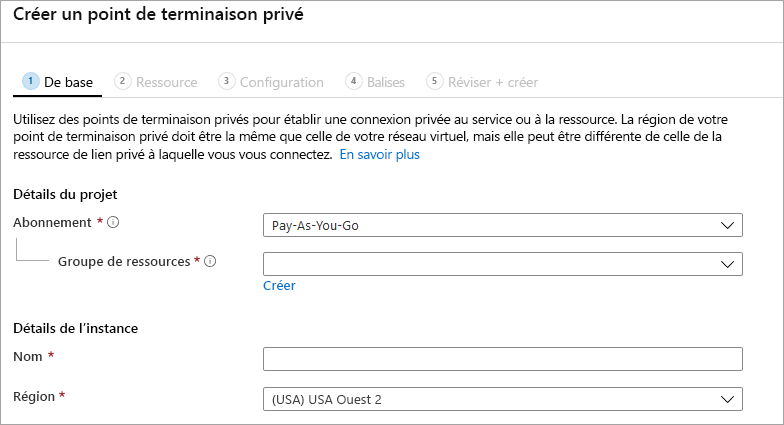
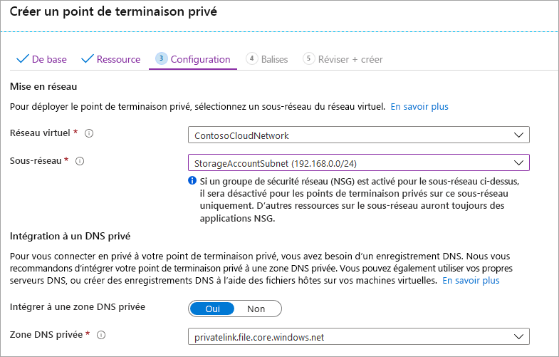

Accédez au compte de stockage pour lequel vous souhaitez créer un point de terminaison privé. Dans la table des matières du compte de stockage, sélectionnez **Réseau**, **Connexions de point de terminaison privé**, puis **+ Point de terminaison privé** pour créer un point de terminaison privé. 

L’Assistant obtenu comprend plusieurs pages dont vous devez suivre les instructions.

Dans le panneau **De base**, sélectionnez le groupe de ressources, le nom et la région souhaités pour votre point de terminaison privé. Vous pouvez choisir ceux que vous voulez. Ils ne doivent pas nécessairement correspondre au compte de stockage. Vous devez simplement créer le point de terminaison privé dans la même région que le réseau virtuel dans lequel vous souhaitez créer le point de terminaison privé.

Dans le panneau **Ressource**, activez la case d’option **Se connecter à une ressource Azure de mon annuaire**. Sous **Type de ressource**, sélectionnez **Microsoft.Storage/storageAccounts** pour le type de ressource. Le champ **Ressource** est le compte de stockage contenant le partage de fichiers Azure auquel vous souhaitez vous connecter. La sous-ressource cible est **fichier**, car elle est destinée à Azure Files.

Le panneau **Configuration** vous permet de sélectionner le réseau virtuel et le sous-réseau auxquels vous souhaitez ajouter votre point de terminaison privé. Vous devez sélectionner un sous-réseau distinct du sous-réseau auquel vous avez ajouté votre point de terminaison de service ci-dessus. Le panneau Configuration contient également les informations relatives à la création et à la mise à jour de la zone DNS privée. Nous vous recommandons d’utiliser la zone `privatelink.file.core.windows.net` par défaut.

Cliquez sur **Vérifier + créer** pour créer le point de terminaison privé. 
