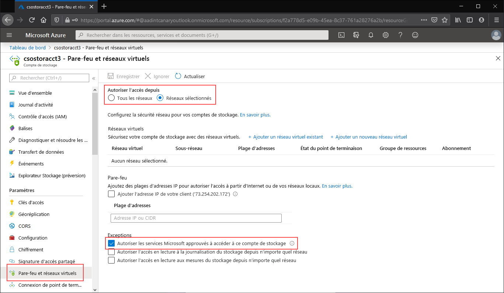

Accédez au compte de stockage pour lequel vous souhaitez limiter tous les accès au point de terminaison public. Dans la table des matières du compte de stockage, sélectionnez **Réseaux**.

En haut de la page, activez la case d’option **Réseaux sélectionnés**. Cela aura pour effet d’afficher un certain nombre de paramètres permettant de contrôler la restriction du point de terminaison public. Cochez la case **Autoriser les services Microsoft approuvés à accéder à ce compte de service** pour autoriser les services Microsoft tiers approuvés, comme Azure File Sync, à accéder au compte de stockage.

