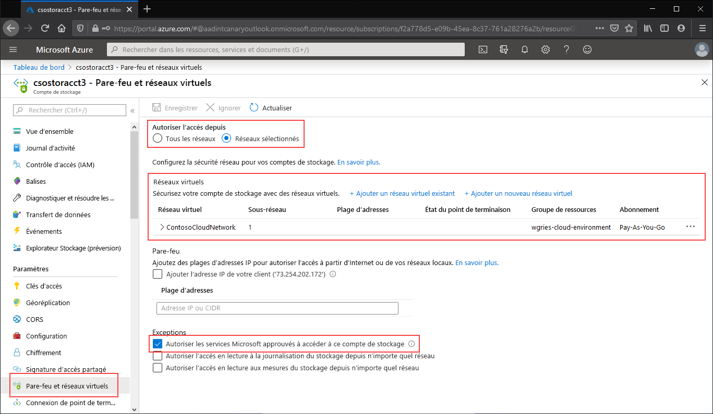

Accédez au compte de stockage dont le point de terminaison public ne doit être accessible qu’à certains réseaux virtuels. Dans la table des matières du compte de stockage, sélectionnez **Réseaux**. 

En haut de la page, activez la case d’option **Réseaux sélectionnés**. Cela aura pour effet d’afficher un certain nombre de paramètres permettant de contrôler la restriction du point de terminaison public. Cliquez sur **+ Ajouter un réseau virtuel existant** pour sélectionner le réseau virtuel qui doit être autorisé à accéder au compte de stockage via le point de terminaison public. Pour cela, vous devez sélectionner un réseau virtuel et un sous-réseau de ce réseau virtuel. 

Cochez la case **Autoriser les services Microsoft approuvés à accéder à ce compte de service** pour autoriser les services Microsoft tiers approuvés, comme Azure File Sync, à accéder au compte de stockage.

