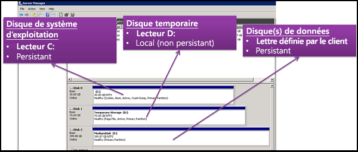
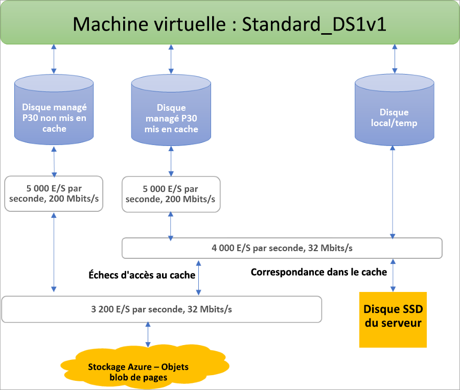

## Avantages des disques managés

Observons quelques-uns des avantages procurés par l’utilisation de disques managés.

### Disponibilité et durabilité élevées

Les disques managés sont conçus pour offrir une disponibilité de 99,999 %. Ils y parviennent en vous fournissant trois réplicas de vos données, ce qui permet d’avoir une durabilité élevée. Si un ou même deux de vos réplicas rencontrent des problèmes, les autres réplicas peuvent assurer la persistance de vos données et offrir une grande tolérance face aux pannes. Cette architecture a permis à Azure de fournir de façon cohérente une durabilité de classe Entreprise pour les disques infrastructure as a service (IaaS), avec un taux de défaillance annuel inégalé dans le secteur de zéro %.

### Déploiement de machines virtuelles simple et évolutif

Avec des disques managés, vous pouvez créer jusqu’à 50 000 **disques** de machines virtuelles d’un type dans un abonnement par région. Ainsi, vous êtes en mesure de créer des milliers de **machines virtuelles** dans un seul abonnement. Par ailleurs, cette fonctionnalité optimise l’évolutivité des [groupes de machines virtuelles identiques](../articles/virtual-machine-scale-sets/virtual-machine-scale-sets-overview.md) en vous donnant les moyens de créer jusqu’à 1 000 machines virtuelles dans une instance de groupe de machines virtuelles identiques à l’aide d’une image de place de marché.

### Intégration avec des groupes à haute disponibilité

Les disques managés sont intégrés avec des groupes à haute disponibilité pour garantir que les disques des [machines virtuelles d’un groupe à haute disponibilité](../articles/virtual-machines/windows/manage-availability.md#use-managed-disks-for-vms-in-an-availability-set) sont suffisamment isolés les uns des autres pour éviter un point de défaillance unique. Les disques sont automatiquement placés dans différentes unités d’échelle de stockage (horodatages). Si un horodatage est mis en échec en raison d’une défaillance matérielle ou logicielle, seules les instances de machine virtuelle possédant des disques sur ces horodatages sont mises en échec. Par exemple, supposons qu’une de vos applications est exécutée sur 5 machines virtuelles, qui sont hébergées dans un groupe à haute disponibilité. Les disques de ces machines virtuelles ne seront pas stockés dans le même horodatage. Par conséquent, si un horodatage est mis en échec, les autres instances de l’application continuent de s’exécuter.

### Intégration aux zones de disponibilité

Les disques managés prennent en charge les [zones de disponibilité](../articles/availability-zones/az-overview.md), qui constituent une offre à haute disponibilité pour la protection de vos applications contre les pannes des centres de données. Les Zones de disponibilité sont des emplacements physiques uniques au sein d’une région Azure. Chaque zone de disponibilité est composée d’un ou de plusieurs centres de données équipés d’une alimentation, d’un système de refroidissement et d’un réseau indépendants. Pour garantir la résilience, un minimum de trois zones distinctes sont activées dans toutes les régions. Avec les Zones de disponibilité, Azure propose des contrats de niveau de service de durée de fonctionnement des machines virtuelles de pointe de 99,99 %.

### Support Sauvegarde Azure

Pour vous protéger contre les sinistres régionaux, [Sauvegarde Azure](../articles/backup/backup-overview.md) peut être utilisé pour créer un travail de sauvegarde avec des sauvegardes périodiques et des stratégies de rétention de sauvegarde. Cela vous permet d’effectuer des restaurations de machines virtuelles ou de disques managés à votre convenance. Actuellement, le service Sauvegarde Azure prend en charge les tailles de disque jusqu’à 32 tébioctets (Tio). [Apprenez-en davantage](../articles/backup/backup-support-matrix-iaas.md) sur la prise en charge de la sauvegarde des machines virtuelles Azure.

### Contrôle d’accès granulaire

Utilisez le [contrôle d’accès en fonction du rôle Azure](../articles/role-based-access-control/overview.md) afin d’affecter à un ou plusieurs utilisateurs des autorisations spécifiques d’accès à un disque managé. Les disques managés exposent différentes opérations, notamment la lecture, l’écriture (création/mise à jour), la suppression et la récupération d’un [URI de signature d’accès partagé](../articles/storage/common/storage-dotnet-shared-access-signature-part-1.md) pour le disque. N’accordez l’accès qu’aux opérations dont une personne a besoin pour exécuter son travail. Par exemple, si vous voulez empêcher un utilisateur de copier un disque managé sur un compte de stockage, vous pouvez décider de lui interdire l’accès à l’action d’exportation sur ce disque managé. De la même manière, si vous voulez empêcher un utilisateur d’employer un URI de signature d’accès partagé pour copier un disque managé, vous pouvez décider de ne pas lui octroyer l’autorisation d’accès à ce disque managé.

### Charger votre disque dur virtuel

 Le chargement direct vous permet de transférer facilement votre disque dur virtuel vers un disque managé Azure. Jusqu’à présent, vous deviez suivre un processus complexe qui impliquait le placement temporaire de vos données dans un compte de stockage. Il y a désormais moins d’étapes. Il est plus facile de charger des machines virtuelles locales sur Azure et de charger sur de gros disques managés, et le processus de sauvegarde et de restauration est simplifié. Ceci réduit également les coûts, en vous permettant de charger des données directement sur des disques managés sans les attacher aux machines virtuelles. Vous pouvez utiliser le chargement direct pour charger des disques durs virtuels d’une taille maximale de 32 Tio.

 Pour découvrir comment transférer votre disque dur virtuel sur Azure, consultez les articles [CLI](../articles/virtual-machines/linux/disks-upload-vhd-to-managed-disk-cli.md) ou [PowerShell](../articles/virtual-machines/windows/disks-upload-vhd-to-managed-disk-powershell.md).

## Chiffrement

Les disques managés offrent deux types de chiffrement différents. Le premier est le chiffrement côté serveur (SSE, Server Side Encryption), qui est effectué par le service de stockage. Le second est Azure Disk Encryption, que vous pouvez activer sur les disques de système d’exploitation et de données pour vos machines virtuelles.

### Chiffrement côté serveur

Le [chiffrement côté serveur Azure](../articles/virtual-machines/windows/disk-encryption.md) assure le chiffrement au repos et la protection de vos données pour assurer le respect des engagements de votre organisation en matière de sécurité et de conformité. Le chiffrement côté serveur est activé par défaut pour l’ensemble des disques managés, captures instantanées et images dans toutes les régions où des disques managés sont disponibles. (En revanche, les disques temporaires ne sont pas chiffrés par Storage Service Encryption ; consultez [Rôles de disque : disques temporaires](#temporary-disk)).

Vous pouvez soit autoriser Azure à gérer vos clés pour vous (clés gérées par la plateforme), soit les gérer vous-même (clés gérées par le client). Pour plus d’informations, voir la [page du FAQ sur la fonctionnalité Disques managés](../articles/virtual-machines/windows/faq-for-disks.md#managed-disks-and-storage-service-encryption).

### Azure Disk Encryption

Azure Disk Encryption vous permet de chiffrer les disques de données et de système d’exploitation utilisés par une machine virtuelle IaaS. Ce chiffrement inclut les disques managés. Sur Windows, les disques sont chiffrés à l’aide de la technologie de chiffrement BitLocker standard. Sur Linux, les disques sont chiffrés à l’aide de la technologie DM-Crypt. Le processus de chiffrement est intégré à Azure Key Vault pour vous permettre de contrôler et gérer les clés de chiffrement de disque. Pour plus d'informations, consultez [Azure Disk Encryption pour les machines virtuelles Linux](../articles/virtual-machines/linux/disk-encryption-overview.md), ou [Azure Disk Encryption pour les machines virtuelles Windows](../articles/virtual-machines/windows/disk-encryption-overview.md).

## Rôles de disque

Il existe trois rôles de disque principaux dans Azure : le disque de données, le disque de système d’exploitation et le disque temporaire. Ces rôles sont mappés à des disques qui sont attachés à votre machine virtuelle.

### Disque de données

Un disque de données est un disque managé attaché à une machine virtuelle pour stocker des données d’application ou d’autres données que vous devez conserver. Les disques de données sont enregistrés en tant que disques SCSI et sont nommés avec la lettre de votre choix. Chaque disque de données a une capacité maximale de 32 767 gibioctets (Gio). La taille de la machine virtuelle détermine le nombre de disques de données que vous pouvez attacher et le type de stockage que vous pouvez utiliser pour héberger les disques.

### Disque de système d’exploitation

Chaque machine virtuelle dispose d’un disque de système d’exploitation attaché. Ce disque de système d’exploitation est doté d’un système d’exploitation préinstallé qui a été sélectionnée lors de la création de la machine virtuelle. Ce disque contient le volume de démarrage.

Ce disque a une capacité maximale de 2 048 Gio.

### Disque temporaire

Chaque machine virtuelle contient un disque temporaire qui n’est pas un disque managé. Il fournit un stockage à court terme pour les applications et les processus, et est destiné à stocker seulement des données comme les fichiers de pagination ou d’échange. Les données présentes sur le disque temporaire peuvent être perdues lors d’un [événement de maintenance](../articles/virtual-machines/windows/manage-availability.md?toc=%2fazure%2fvirtual-machines%2fwindows%2ftoc.json#understand-vm-reboots---maintenance-vs-downtime) ou quand vous [redéployez une machine virtuelle](../articles/virtual-machines/troubleshooting/redeploy-to-new-node-windows.md?toc=%2Fazure%2Fvirtual-machines%2Fwindows%2Ftoc.json). Lors d’un redémarrage standard réussi de la machine virtuelle, les données présentes sur le disque temporaire sont conservées.  

Sur les machines virtuelles Azure Linux, le disque temporaire est en général /dev/sdb, tandis que sur les machines virtuelles Windows il s’agit de D: par défaut. Le disque temporaire n’est pas chiffré par le chiffrement côté serveur (voir [Chiffrement](#encryption)).

## Captures instantanées de disque managé

La capture instantanée d’un disque managé est une copie en lecture seule et cohérente en cas d’incident d’un disque managé qui est stockée comme disque managé standard par défaut. Avec des captures instantanées, vous pouvez sauvegarder vos disques managés à tout moment dans le temps. Ces captures instantanées existent indépendamment du disque source et peuvent être utilisées pour créer des disques managés par la suite. 

Les instantanés sont facturés en fonction de la taille utilisée. Par exemple, si vous créez une capture instantanée d’un disque managé avec une capacité approvisionnée de 64 Gio et une taille des données utilisées réelle de 10 Gio, cet instantané est facturé uniquement pour la taille des données utilisées de 10 Gio. Vous pouvez voir la taille utilisée de vos captures instantanées en examinant le [rapport d’utilisation d’Azure](https://docs.microsoft.com/azure/billing/billing-understand-your-bill). Par exemple, si la taille de données utilisée d’un instantané est 10 Gio, le rapport d’utilisation **quotidien** affiche 10 Gio/(31 jours) = 0,3226 Gio comme quantité consommée.

Pour en savoir plus sur la création d’instantanés pour les disques managés, consultez les ressources suivantes :

* [Créer un instantané d’un disque managé dans Windows](../articles/virtual-machines/windows/snapshot-copy-managed-disk.md)
* [Créer un instantané d’un disque managé dans Linux](../articles/virtual-machines/linux/snapshot-copy-managed-disk.md)

### Images

Les disques managés prennent également en charge la création d’une image personnalisée gérée. Vous pouvez créer une image à partir de votre disque dur virtuel (VHD) personnalisé dans un compte de stockage ou directement à partir d’une machine virtuelle généralisée (préparée à l’aide de Sysprep). Ce processus capture une seule image. Cette image contient tous les disques managés associés à une machine virtuelle, notamment les disques de données et les disques du système d’exploitation. Cette image personnalisée managée permet de créer des centaines de machines virtuelles à l’aide de votre image personnalisée, sans qu’il soit nécessaire de copier ou de gérer un compte de stockage.

Pour plus d’informations sur la création des images, consultez les articles suivants :

* [Procédure de capture d’une image managée d’une machine virtuelle généralisée dans Azure](../articles/virtual-machines/windows/capture-image-resource.md)
* [Guide pratique de généralisation et de capture d’une machine virtuelle Linux avec Azure CLI](../articles/virtual-machines/linux/capture-image.md)

#### Images et captures instantanées

Il est important de bien saisir la différence entre des images et des captures instantanées. Les disques managés vous permettent de saisir une image d’une machine virtuelle généralisée qui a été libérée. Cette image comprend l’ensemble des disques attachés à la machine virtuelle. Vous pouvez l’utiliser pour créer une machine virtuelle qui intègre l’ensemble des disques.

Une capture instantanée est une copie d’un disque à un instant t. Elle s’applique uniquement à un disque. Si vous possédez une machine virtuelle qui présente un disque (le disque du système d’exploitation), vous pouvez en saisir une capture instantanée ou une image à partir desquelles vous créez une machine virtuelle.

Une capture instantanée n’a connaissance d’aucun autre disque que celui qu’elle contient. Il est donc difficile de l’utiliser dans des scénarios qui nécessitent la coordination de plusieurs disques, tels que l’agrégation par bandes. Pour cela, les captures instantanées devraient être capables de se coordonner entre elles, ce qui n’est actuellement pas pris en charge.

## Allocation des disques et performances

Le diagramme suivant illustre l’allocation de bande passante et d’IOPS en temps réel pour les disques, à l’aide d’un système de provisionnement à trois niveaux :

Le provisionnement de premier niveau définit le nombre d’IOPS par disque et l’affectation de bande passante.  Au deuxième niveau, l’hôte du serveur de calcul implémente le provisionnement SSD, en l’appliquant uniquement aux données stockées sur le disque SSD du serveur, ce qui inclut les disques avec mise en cache (ReadWrite et ReadOnly), ainsi que les disques locaux et temporaires. Pour finir, le provisionnement du réseau de machines virtuelles a lieu au troisième niveau pour les E/S que l’hôte de calcul envoie au back-end Stockage Azure. Avec ce schéma, les performances d’une machine virtuelle dépendent de différents facteurs, de la manière dont la machine virtuelle utilise le disque SSD local jusqu’au nombre de disques attachés, en passant par le type de mise en cache et les performances de ces disques.

À titre d’exemple de ces limitations, une machine virtuelle Standard_DS1v1 ne peut pas atteindre le potentiel de 5 000 IOPS d’un disque P30, qu’elle soit mise en cache ou non, en raison des limites au niveau des disques SSD et du réseau :

Azure utilise pour le trafic de disque un canal réseau qui est prioritaire par rapport à tout autre trafic réseau de faible priorité. Cela aide les disques à conserver leurs performances attendues en cas de contention de réseau. De même, Stockage Azure gère les conflits de ressources et autres problèmes en arrière-plan avec l’équilibrage de charge automatique. Stockage Azure alloue les ressources nécessaires quand vous créez un disque, et applique un équilibrage proactif et réactif des ressources pour gérer le niveau de trafic. Cela permet de s’assurer que les disques peuvent supporter leurs cibles d’IOPS et de débit attendues. Vous pouvez utiliser les métriques au niveau de la machine virtuelle et du disque pour suivre les alertes de performances et de configuration en fonction des besoins.

Consultez notre article sur la [conception pour des performances élevées](../articles/virtual-machines/windows/premium-storage-performance.md) afin de connaître les bonnes pratiques permettant d’optimiser les configurations de machines virtuelles et de disques et d’obtenir les performances souhaitées.

## Étapes suivantes

Si vous souhaitez obtenir une vidéo qui aborde plus en détail les disques managés, consultez : [Meilleure résilience de machine virtuelle Azure avec la fonctionnalité Disques managés](https://channel9.msdn.com/Blogs/Azure/Managed-Disks-for-Azure-Resiliency).

Apprenez-en davantage sur les différentes offres de types de disques Azure, sur le type de disque le plus adapté à vos besoins et sur les cibles de performances en lisant notre article sur les types de disques.
