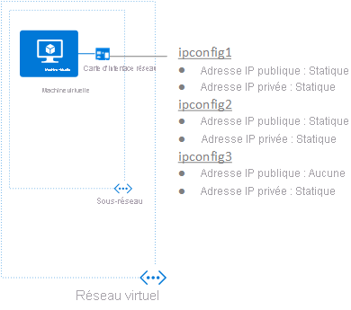

## Scénario
Une machine virtuelle avec une seule carte réseau est créée et connectée à un réseau virtuel. La machine virtuelle nécessite trois adresses IP *privées* différentes et deux adresses IP *publiques*. Les adresses IP sont affectées aux configurations IP suivantes :

* **IPConfig-1:** Assigne un *statique* adresse IP privée et un *statique* adresse IP publique.
* **IPConfig-2 :** Assigne un *statique* adresse IP privée et un *statique* adresse IP publique.
* **IPConfig-3:** Assigne un *statique* adresse IP privée et aucune adresse IP publique.

    

Les configurations IP sont associées à la carte réseau lors de sa création, et la carte réseau est attachée à la machine virtuelle lors de la création de celle-ci. Les types d’adresses IP utilisés pour le scénario sont indiqués à titre d’illustration. Vous pouvez affecter les types d’adresses IP et d’affectations dont vous avez besoin.

> [!NOTE]
> Bien que les étapes décrites dans cet article affectent toutes les configurations IP à une seule carte réseau, vous pouvez également affecter plusieurs configurations IP à une carte réseau quelconque dans une machine virtuelle équipée de plusieurs cartes réseau. Pour apprendre à créer une machine virtuelle avec plusieurs cartes réseau, consultez l’article [Créer une machine virtuelle avec plusieurs cartes d’interface réseau](../articles/virtual-machines/windows/multiple-nics.md).
