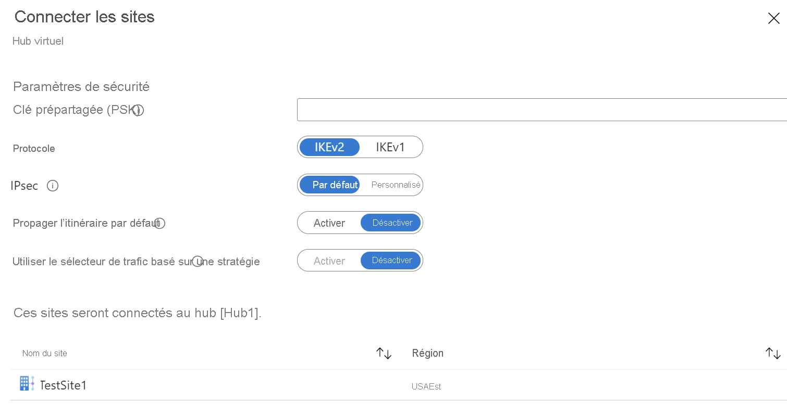

1. Sélectionnez **Connecter des sites VPN** pour ouvrir la page **Connecter des sites**.

    

   Renseignez les champs suivants :

   * Entrez une clé prépartagée. Si vous n’entrez pas de clé, Azure en génère automatiquement une pour vous.
   * Sélectionnez les paramètres Protocole et IPsec. Pour plus d’informations, consultez « Stratégies IPsec par défaut » (https://docs.microsoft.com/azure/virtual-wan/virtual-wan-ipsec)
   * Sélectionnez l’option appropriée pour **Propager l’itinéraire par défaut**. L’option **Activer** permet au hub virtuel de propager un itinéraire par défaut appris à cette connexion. Cet indicateur active la propagation de l’itinéraire par défaut à une connexion uniquement si l’itinéraire par défaut est déjà appris par le hub Virtual WAN suite au déploiement d’un pare-feu dans le hub, ou si le tunneling forcé est activé sur un autre site connecté. L’itinéraire par défaut ne provient pas du hub Virtual WAN.

2. Sélectionnez **Connecter**.
3. En quelques minutes, le site affiche la connexion et l’état de la connectivité.

   

   **État de la connexion :** Il s’agit de l’état de la ressource Azure pour la connexion qui connecte le site VPN à la passerelle VPN du hub Azure. Une fois cette opération de plan de contrôle réussie, la passerelle VPN Azure et le périphérique VPN local continuent d’établir la connectivité.

   **État de la connectivité :** Il s’agit de l’état de connectivité réel (chemin d’accès aux données) entre la passerelle VPN d’Azure dans le hub et le site VPN. Il peut afficher l’un des états suivants :

    * **Inconnue** : Cet état est généralement observé si les systèmes principaux travaillent à la transition vers un autre état.
    * **Connexion en cours** : La passerelle VPN Azure tente d’accéder au site VPN local réel.
    * **Connecté** : La connectivité est établie entre la passerelle VPN Azure et le site VPN local.
    * **Déconnecté** : Cet état s’affiche si, pour une raison quelconque (localement ou dans Azure), la connexion a été déconnectée.
4. Au sein d’un site VPN hub, vous pouvez également effectuer les opérations suivantes : 

   * Modifier ou supprimer la connexion VPN.
   * Supprimer le site dans le Portail Azure.
   * Télécharger une configuration spécifique à une branche pour plus d’informations sur la partie Azure à l’aide du menu contextuel (…) à côté du site. Si vous souhaitez télécharger la configuration de tous les sites connectés dans votre hub, sélectionnez **Télécharger la configuration VPN** dans le menu supérieur.
